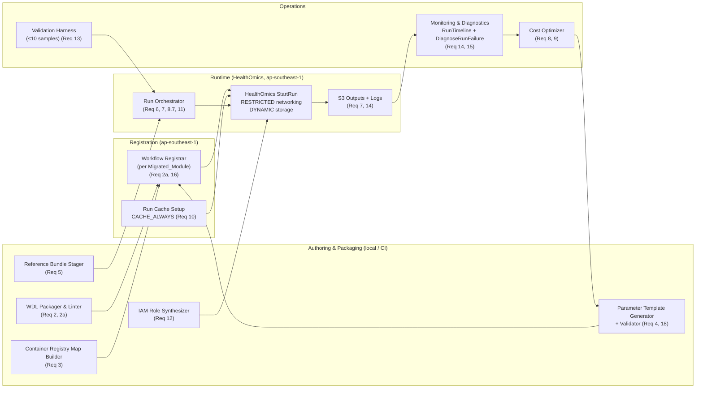
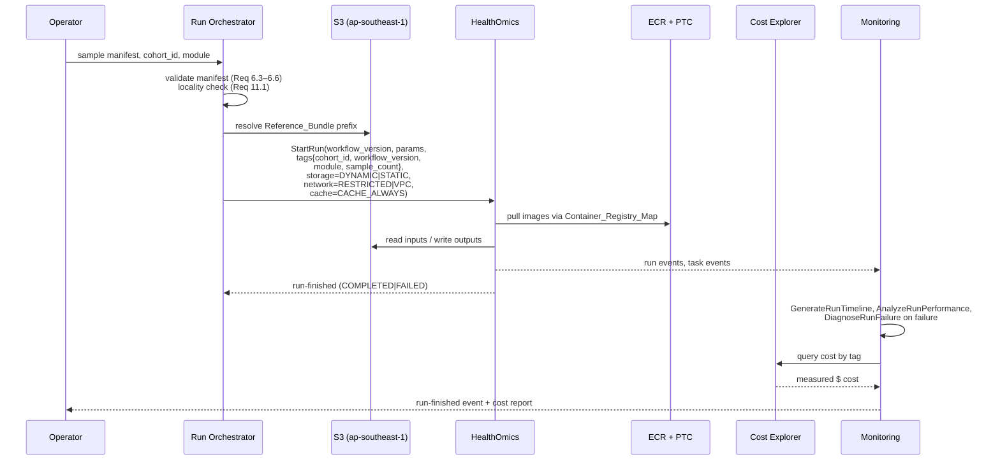

# Design Document

## Overview

This design describes the Migration_System that ports the Broad Institute's GATK_SV pipeline (WDL, originally Terra/Cromwell on GCP) to AWS HealthOmics in Target_Region (ap-southeast-1). The system registers every module in Migrated_Modules (GatherSampleEvidence → AnnotateVcf) as a HealthOmics workflow, integrates the callers in SV_Caller_Set (Manta, Wham, Scramble, GATK-gCNV) while excluding MELT, stages the Reference_Bundle in regional S3, routes container pulls through ECR + Pull_Through_Caches, and runs cohorts behind a least-privilege IAM role with Run_Cache enabled. The Cost_Optimizer drives end-to-end per-sample cost to at or below Per_Sample_Cost_Target (USD $7.00) using DYNAMIC storage, RESTRICTED_Networking, CACHE_ALWAYS caching, and an AnalyzeRunPerformance-driven right-sizing loop with 20% headroom (Reqs 1, 2, 2a, 3, 5, 8–12).

## Architecture

### Component Topology



### Data Flow for a Cohort Run



### Registration-Per-Module Model

Each module in Migrated_Modules is registered as its own HealthOmics workflow (Req 2a.1, 16). The Run Orchestrator chains module runs in sequence using the previous module's outputs as the next module's inputs. This keeps each workflow small enough for HealthOmics to lint cleanly, isolates right-sizing per module, and lets workflow versions advance independently.

## Components and Interfaces

### (a) WDL Packager & Linter

**Responsibilities:** Fetch GATK_SV sources at a pinned commit, excise MELT-referencing tasks (Req 2a.3–2a.4), rewrite constructs HealthOmics rejects, and package each module's WDL bundle as a ZIP for Workflow_Registration. Enforces WDL 1.0/1.1 (Req 2.1), rejects gs:// URIs at packaging time (Req 2.6), and invokes `LintAHOWorkflowBundle` with zero-error gating (Req 2.3).

**Inputs:** Upstream `gatk-sv` repo URL and commit SHA, module name ∈ Migrated_Modules.
**Outputs:** `bundle.zip`, `divergence.json` (list of applied edits), lint report.

**API sketch (Python):**
```python
def package_module(commit: str, module: ModuleName) -> PackagedBundle: ...
# PackagedBundle = { zip_path, main_wdl_path, divergence: list[DivergenceEntry], lint_report }
```

### (b) Container Registry Map Builder

**Responsibilities:** Walk every `runtime { docker: ... }` reference across all packaged bundles, canonicalize it (reject floating tags per Req 3.5), and produce a Container_Registry_Map. Prefers Pull_Through_Cache routing for Docker Hub, GCR, Quay.io (Req 3.3); falls back to `CloneContainerToECR` only when PTC cannot resolve (Req 3.4). Verifies ECR repository policies grant `ecr:BatchGetImage` and `ecr:GetDownloadUrlForLayer` to HealthOmics (Req 3.2).

**Inputs:** List of packaged bundles, existing ECR registry state in Target_Region.
**Outputs:** `container-registry-map.json`, ECR repository policy diffs applied, PTC rules created.

**API sketch:**
```python
def build_registry_map(bundles: list[PackagedBundle]) -> ContainerRegistryMap: ...
def verify_registry_map(m: ContainerRegistryMap) -> list[MapIssue]: ...
```

### (c) Parameter Template Generator + Validator

**Responsibilities:** This is the PBT-tested component for Req 18. Parses each workflow's WDL inputs and emits a Parameter_Template JSON document (Req 4.1–4.2, 18.1). Validates a Parameter_Template against a WDL, reporting missing or extra inputs (Req 18.2, 18.4, 18.5). Enforces that `File`-typed inputs must be S3 URIs in Target_Region (Req 4.4).

**Inputs:** WDL file, optional existing template JSON.
**Outputs:** Template JSON, validation report.

**API sketch:**
```python
def generate_template(wdl: WdlWorkflow) -> ParameterTemplate: ...
def validate_template(tpl: ParameterTemplate, wdl: WdlWorkflow) -> ValidationReport: ...
# Round-trip property (Req 18.3): validate_template(generate_template(w), w).is_match
```

### (d) Reference Bundle Stager

**Responsibilities:** Copy Reference_Bundle files from Broad upstream storage to a regional S3 prefix (Req 5.2), verify each copy against the upstream checksum (Req 5.3), and fail the provisioning run with per-file detail on any mismatch (Req 5.4). Maintains the canonical manifest of required files per module (Req 5.1) for GRCh38 (Req 5.5) and a separately documented, optional GRCh37 set (Req 5.6).

**Inputs:** Upstream source URIs (https, gs — only at staging, not at runtime), target S3 prefix in Target_Region.
**Outputs:** Staged S3 objects, `reference-bundle-manifest.json`, checksum verification report.

**API sketch:**
```python
def stage_reference_bundle(build: Literal["GRCh38", "GRCh37"],
                           src: ReferenceSource,
                           dst_s3_prefix: str) -> StageReport: ...
```

### (e) IAM Role Synthesizer

**Responsibilities:** Emit a HealthOmics run role scoped to Target_Region with read access limited to the S3 prefixes holding Reference_Bundle, Sample_Input, and workflow ZIPs (Req 12.2), write access limited to declared output prefixes (Req 12.3), ECR pull scoped to repositories in the Container_Registry_Map (Req 12.4), and CloudWatch Logs writes scoped to `/aws/omics/*` (Req 12.5). Runs a broadness check that rejects any statement broader than the declared prefixes (Req 12.6).

**Inputs:** Container_Registry_Map, Reference_Bundle prefix, output prefix(es), cohort manifest.
**Outputs:** IAM policy JSON, trust policy JSON, broadness-check report.

**API sketch:**
```python
def synthesize_run_role(scope: RoleScope) -> RolePolicies: ...
def check_broadness(policy: dict, scope: RoleScope) -> list[BroadnessViolation]: ...
```

### (f) Workflow Registrar

**Responsibilities:** For each module in Migrated_Modules, call `CreateAHOWorkflow` (first registration) or `CreateAHOWorkflowVersion` (subsequent changes) with the packaged bundle, Parameter_Template, and Container_Registry_Map (Req 16.1). Applies a semantic version string (Req 16.2). Records upstream commit SHA and divergence list in the Workflow_Version_Record (Req 16.3).

**API sketch:**
```python
def register_module(module: ModuleName,
                    bundle: PackagedBundle,
                    template: ParameterTemplate,
                    registry_map: ContainerRegistryMap,
                    semver: str) -> WorkflowVersionRecord: ...
```

### (g) Run Orchestrator

**Responsibilities:** Accept a sample manifest and cohort identifier, validate the manifest (Reqs 6.3–6.6), check all artifacts are in Target_Region (Req 11.1), choose storage mode (DYNAMIC default, STATIC when total input > 1 TiB per Req 8.1–8.2), choose networking (RESTRICTED default per Req 11.2, VPC opt-in per Req 11.3), attach the Run_Cache (Req 10.1, 10.2), emit cost-tracking tags (Req 8.7), and invoke `StartAHORun` in module order. Records the workflow version on each run (Req 16.4). On completion, verifies each declared output exists (Req 7.4) and relabels the run FAILED if any is missing (Req 7.5).

**Inputs:** `sample_manifest.csv|json`, cohort_id, per-module workflow version map, output prefix.
**Outputs:** Per-module run IDs, run-started and run-finished events (Req 14.1, 14.2).

**API sketch:**
```python
def submit_cohort(manifest: SampleManifest,
                  cohort_id: str,
                  versions: dict[ModuleName, str],
                  output_uri: str,
                  storage: StorageChoice = "DYNAMIC",
                  networking: NetMode = "RESTRICTED",
                  cache_behavior: CacheBehavior = "CACHE_ALWAYS") -> CohortRunRecord: ...
```

### (h) Cost Optimizer

**Responsibilities:** After each cohort run, pull `AnalyzeAHORunPerformance` output, combine with Cost Explorer tag-based spend, and (1) record measured per-module peak working set for STATIC sizing updates (Req 8.3), (2) produce CPU/memory recommendations with 20% headroom after ≥3 cohort-scale executions per task (Req 9.2), (3) log and surface any recommendation that would reduce CPU or memory by ≥25% (Req 9.3), (4) never apply recommendations automatically — Operator approves each (Req 9.4), (5) compute per-sample cost and flag overages of Per_Sample_Cost_Target with attribution by module/task/dimension (Req 8.5, 8.6, 13.5).

**Inputs:** Run IDs, cohort_id, Cost Explorer credentials, prior optimization log.
**Outputs:** `cost-report.json`, `optimization-log.jsonl`, human-readable overage report.

**API sketch:**
```python
def analyze_cohort(runs: list[str], cohort_id: str) -> CostReport: ...
def recommend(task_stats: list[TaskStats], headroom: float = 0.20) -> list[Recommendation]: ...
```

### (i) Monitoring & Diagnostics

**Responsibilities:** Emit run-started and run-finished events with duration and measured dollar cost (Req 14.1, 14.2). Invoke `DiagnoseAHORunFailure` on any FAILED run and attach its output to the run-finished event (Req 14.3). Invoke `GenerateAHORunTimeline` for any COMPLETED or FAILED run longer than 30 minutes (Req 14.4). Invoke `AnalyzeAHORunPerformance` for every COMPLETED run (Req 14.5). Record each retry attempt in the run-level log (Req 15.4).

### (j) Validation Harness

**Responsibilities:** Drive a documented ≤10-sample cohort end-to-end (Req 13.1), then compare the produced Cohort_VCF against the expected Cohort_VCF on SV site concordance: ≥99% for DEL/DUP, ≥95% for INS/INV (Req 13.2, 13.3). Report measured $ cost and measured per-sample cost (Req 13.4) and, if per-sample cost exceeds Per_Sample_Cost_Target, include Cost_Optimizer recommendations (Req 13.5).

The validation surface is split across three independent concordance checks, each backed by an acceptance test under `tests/gatk_sv_healthomics/acceptance/`:

1. **Strict cohort concordance** (`compare_cohort_vcf`) — exact `(CHROM, POS, SVTYPE)` join. Bit-identical-or-bust gate against a reference VCF produced by Broad's upstream pipeline on Terra.
2. **Fuzz-tolerant cohort concordance** (`compare_cohort_vcf_fuzzy`) — same join with ±50 bp window on POS. Matches Broad's published validation tolerance and is the gate the Migration_System actually publishes against.
3. **Cross-engine divergence** (`diff_artifact`) — for a single sample, normalises GatherSampleEvidence outputs (PE/SR/RD/Manta/Wham/Scramble) and compares the HealthOmics result against the same WDL run on EC2 via miniwdl. VCFs are body-only-md5 (header `##` lines stripped, records sorted) so timestamps and run-IDs do not cause spurious divergence; PE/SR/RD `.txt.gz` files are compared by full body bytes.

The runbook in `gatk-sv-healthomics/docs/validation-runbook.md` documents how to produce the Broad reference VCF and rerun a single sample on EC2.


## Data Models

### Sample Manifest

```json
{
  "cohort_id": "cohort-sg-2025q1",
  "reference_build": "GRCh38",
  "samples": [
    {
      "sample_id": "NA12878",
      "reads_uri": "s3://bucket/.../NA12878.cram",
      "index_uri": "s3://bucket/.../NA12878.cram.crai",
      "sex": "F"
    }
  ]
}
```
Validation rules: reads_uri must be CRAM+CRAI or BAM+BAI (Req 6.1, 6.2); index must be present (Req 6.5); sample_id must be unique across the manifest (Req 6.6); every URI must be an s3:// URI in Target_Region (Req 11.1).

### Container Registry Map

```json
{
  "registryMappings": [
    { "upstreamRegistryUrl": "quay.io",
      "ecrRepositoryPrefix": "quay",
      "upstreamRepositoryPrefix": "biocontainers" }
  ],
  "imageMappings": [
    { "sourceImage": "us.gcr.io/broad-dsde-methods/gatk-sv/sv-pipeline:2024-09-01-v1.2.3-abcdef",
      "destinationImage": "111111111111.dkr.ecr.ap-southeast-1.amazonaws.com/gatk-sv/sv-pipeline@sha256:..." }
  ]
}
```
Invariant: every `sourceImage` and `destinationImage` ends in `:<immutable-tag>` or `@sha256:<digest>`; the string `:latest` and bare image references are rejected at build time (Req 3.5).

### Parameter Template

```json
{
  "reference_fasta": {
    "description": "GRCh38 primary assembly FASTA (S3 URI in ap-southeast-1)",
    "optional": false,
    "type": "File"
  },
  "batch_name": {
    "description": "Cohort batch identifier",
    "optional": false,
    "type": "String"
  }
}
```
Every `"type": "File"` entry is required to be an s3:// URI in Target_Region at run submission (Req 4.4).

### Run Cache Reference

```json
{
  "cache_id": "1234567890",
  "cache_behavior": "CACHE_ALWAYS",
  "region": "ap-southeast-1",
  "s3_location": "s3://my-omics-cache/gatk-sv/"
}
```

### Cost Report

```json
{
  "cohort_id": "cohort-sg-2025q1",
  "sample_count": 100,
  "runs": [
    { "module": "GatherSampleEvidence", "run_id": "...", "cost_usd": 123.45,
      "wall_clock_sec": 7200, "tags": {...} }
  ],
  "total_cost_usd": 654.00,
  "per_sample_cost_usd": 6.54,
  "target_usd": 7.00,
  "over_target": false,
  "attribution": [
    { "module": "GenotypeBatch", "dimension": "compute", "cost_usd": 210.00 }
  ]
}
```

### Divergence Log Entry

```json
{
  "module": "GatherSampleEvidence",
  "upstream_path": "wdl/GatherSampleEvidence.wdl",
  "change_kind": "remove_task" | "rewrite_construct" | "swap_container" | "remove_caller",
  "reason": "MELT excluded per Req 2a.3",
  "upstream_commit": "abcdef1"
}
```

### Workflow Version Record

```json
{
  "module": "AnnotateVcf",
  "workflow_id": "1234567",
  "version_name": "v1.2.3",
  "semver": "1.2.3",
  "upstream_commit": "abcdef1",
  "divergences": ["..."],
  "container_registry_map_uri": "s3://.../container-registry-map.json",
  "parameter_template_uri": "s3://.../parameter-template.json"
}
```

## Workflow Module Mapping

| Upstream GATK_SV Module | HealthOmics Workflow Name | Primary Containers (redirected via Container_Registry_Map) | Reference Inputs | Outputs | MELT-Exclusion Changes |
|---|---|---|---|---|---|
| GatherSampleEvidence | `gatk-sv-gather-sample-evidence` | `gatk-sv/sv-pipeline`, `gatk-sv/manta`, `gatk-sv/wham`, `gatk-sv/scramble`, `broadinstitute/gatk` | GRCh38 FASTA + .fai + .dict, PAR bed, exclusion bed | per-sample PE/SR/RD/BAF, Manta/Wham/Scramble VCFs | MELT task removed; Manta/Wham/Scramble retained |
| GatherBatchEvidence | `gatk-sv-gather-batch-evidence` | `gatk-sv/sv-pipeline`, `broadinstitute/gatk` (gCNV) | gCNV training model, contig ploidy priors | batch evidence matrices, gCNV calls | MELT evidence channels dropped |
| ClusterBatch | `gatk-sv-cluster-batch` | `gatk-sv/sv-pipeline` | allosome/autosome contig sets | clustered SV VCF per batch | MELT input channel removed |
| GenerateBatchMetrics | `gatk-sv-generate-batch-metrics` | `gatk-sv/sv-pipeline` | reference dict, exclusion bed | per-batch metrics TSV | — |
| FilterBatch | `gatk-sv-filter-batch` | `gatk-sv/sv-pipeline` | SV allele frequency resource | filtered VCF per batch | — |
| MergeBatchSites | `gatk-sv-merge-batch-sites` | `gatk-sv/sv-pipeline` | reference dict | merged sites VCF | — |
| GenotypeBatch | `gatk-sv-genotype-batch` | `gatk-sv/sv-pipeline` | reference FASTA, PE/SR/RD matrices | genotyped SV VCF | — |
| RegenotypeCNVs | `gatk-sv-regenotype-cnvs` | `gatk-sv/sv-pipeline` | RD matrix, gCNV calls | regenotyped CNVs | — |
| MakeCohortVcf | `gatk-sv-make-cohort-vcf` | `gatk-sv/sv-pipeline` | reference FASTA, pedigree | cohort-level SV VCF + tabix | MELT site records absent |
| AnnotateVcf | `gatk-sv-annotate-vcf` | `gatk-sv/sv-pipeline`, `ensemblorg/ensembl-vep` | annotation resources (gnomAD-SV, GENCODE) | annotated Cohort_VCF | — |

Every task whose `runtime.docker` references MELT is removed (Req 2a.3–2a.4). Every inter-module boundary file produced by a MELT task is either removed from downstream inputs or replaced with an empty/sentinel input where the WDL requires a non-null value; each such change is recorded in the divergence log (Req 2a.4, 17.2).

## Cost Optimization Strategy

The Cost_Optimizer drives measured per-sample cost to ≤ Per_Sample_Cost_Target (USD $7.00) across the full module chain (Req 8.5). Design decisions:

**Storage sizing.** DYNAMIC is the default for every run (Req 8.1). The orchestrator computes total input bytes from the sample manifest; when > 1 TiB (1,099,511,627,776 bytes), it recommends STATIC with `capacity_gib = ceil(peak_working_set_gib * 1.20)`, where `peak_working_set_gib` comes from the Cost_Optimizer's persisted per-module measurement from the last successful cohort-scale run (Req 8.2, 8.3). STATIC capacity is allocated in 1200 GiB chunks as HealthOmics requires, so the actual `storage_capacity` passed to `StartRun` is `max(1200, ceil(capacity_gib/1200) * 1200)`.

**Right-sizing loop.** CPU and memory for every WDL task are declared explicitly (Req 9.1). After any task has run ≥3 times at cohort scale, the Cost_Optimizer emits a recommendation of `max(observed_peak * 1.20, floor)` for CPU and memory (Req 9.2). Recommendations that reduce CPU or memory by ≥25% are logged to the optimization log and surfaced to the Operator (Req 9.3). No recommendation is applied automatically; the Operator approves each before a new workflow version publishes (Req 9.4, 16.1). GPU count is declared as zero for every task unless a specific task documented in the divergence log requires one (Req 9.5).

**Container pulls.** Pull_Through_Cache rules for Docker Hub, GCR, and Quay.io eliminate per-image clone work (Req 3.3) and keep pulls intra-region, avoiding internet egress. Images are pinned to immutable tags or `@sha256:` digests (Req 3.5) so pulls are cache-hits after the first reference.

**Run caching.** `CACHE_ALWAYS` is the default RunCache behavior (Req 10.2); re-submissions after failure re-use the same cache (Req 10.4). The Operator can override to `CACHE_ON_FAILURE` where stricter isolation is required (Req 10.3).

**Networking.** RESTRICTED is the default (Req 11.2), eliminating NAT gateway charges for egress. VPC mode is accepted as opt-in with subnets/SGs pinned to Target_Region (Req 11.3).

**Output storage class.** When the caller-supplied output bucket has Intelligent-Tiering set as its default storage class, outputs land in Intelligent-Tiering without explicit per-object requests (Req 8.4).

**Cost Explorer tag taxonomy.** Every run-associated resource is tagged with:

| Tag key | Example value | Purpose |
|---|---|---|
| `gatk-sv:cohort-id` | `cohort-sg-2025q1` | Group all runs of a cohort |
| `gatk-sv:workflow-version` | `1.2.3` | Attribute costs to a specific workflow version (Req 16.4) |
| `gatk-sv:module` | `GenotypeBatch` | Attribute costs per module |
| `gatk-sv:sample-count` | `100` | Enable per-sample cost computation |
| `gatk-sv:environment` | `prod` \| `validation` | Separate validation cohort runs from production |

Per-sample cost is computed as `sum(costs for cohort-id) / sample-count` (Req 8.7, 13.4). The Cost_Optimizer queries Cost Explorer with these tag filters to produce the `cost-report.json` described in Data Models.

## IAM & Security

The run role is a single IAM role scoped to Target_Region (Req 12.1). Policies are synthesized from the declared cohort scope, not hand-written, so the broadness check (Req 12.6) can mechanically compare synthesized statements against the declared scope.

**Least-privilege policy skeleton:**

```json
{
  "Version": "2012-10-17",
  "Statement": [
    { "Sid": "S3ReadReferencesAndInputs",
      "Effect": "Allow",
      "Action": ["s3:GetObject", "s3:ListBucket"],
      "Resource": [
        "arn:aws:s3:::<ref-bucket>/<ref-prefix>/*",
        "arn:aws:s3:::<ref-bucket>",
        "arn:aws:s3:::<input-bucket>/<input-prefix>/*",
        "arn:aws:s3:::<input-bucket>",
        "arn:aws:s3:::<wdl-zip-bucket>/<wdl-zip-prefix>/*"
      ] },
    { "Sid": "S3WriteOutputs",
      "Effect": "Allow",
      "Action": ["s3:PutObject", "s3:AbortMultipartUpload"],
      "Resource": ["arn:aws:s3:::<output-bucket>/<output-prefix>/*"] },
    { "Sid": "EcrPullMappedReposOnly",
      "Effect": "Allow",
      "Action": ["ecr:BatchGetImage", "ecr:GetDownloadUrlForLayer",
                 "ecr:BatchCheckLayerAvailability"],
      "Resource": ["arn:aws:ecr:ap-southeast-1:<acct>:repository/gatk-sv/*",
                   "arn:aws:ecr:ap-southeast-1:<acct>:repository/quay/*"] },
    { "Sid": "EcrAuth", "Effect": "Allow", "Action": ["ecr:GetAuthorizationToken"], "Resource": "*" },
    { "Sid": "LogsWriteOmicsOnly",
      "Effect": "Allow",
      "Action": ["logs:CreateLogStream", "logs:PutLogEvents", "logs:DescribeLogStreams"],
      "Resource": "arn:aws:logs:ap-southeast-1:<acct>:log-group:/aws/omics/*" }
  ]
}
```

**Broadness check (Req 12.6).** For each `Resource` entry in the synthesized policy, the checker rejects the policy if any of the following hold for any non-auth, non-logs statement:
- `Resource` is `"*"` (except where the API mandates it, e.g., `ecr:GetAuthorizationToken`).
- `Resource` is a bucket ARN without a prefix when the declared scope has a prefix.
- `Action` contains `s3:*`, `ecr:*`, or wildcarded service verbs wider than the declared action set.
- An S3 `Resource` prefix is a strict prefix of the declared prefix (broader than declared).

Violations are reported as `BroadnessViolation { statement_sid, resource, declared_scope, reason }`.

## Error Handling and Retries

**Retryable failures (Req 15.1).** For HealthOmics-declared retryable task failure codes, the orchestrator (via the workflow's `runtime { maxRetries: 3 }` declaration and HealthOmics' native retry) retries up to three times with exponential backoff (base 30s, factor 2, cap 8m). Each attempt is written to the run log (Req 15.4).

**Retryable-but-exhausted (Req 15.2).** After three consecutive retryable failures for the same task, the run fails and the run-finished event includes `task_id`, `error_code`, and the last 200 lines of task stderr.

**Non-retryable failures (Req 15.3).** HealthOmics-declared non-retryable codes (e.g., validation errors, permission errors, killed-OOM for a task whose memory declaration is already at its maximum) fail the run immediately; the run-finished event includes `task_id` and `error_code`.

**Retry classification table (illustrative, follows HealthOmics semantics):**

| Category | Examples | Behavior |
|---|---|---|
| Transient infra | `InternalServerError`, throttling | Retry up to 3x |
| Resource pressure | OOM (first occurrence) | Retry 1x at declared size; if Cost_Optimizer has a pending increase, surface recommendation |
| Permanent | auth failure, missing input object, WDL validation error | No retry, fail fast |

On any FAILED run, `DiagnoseAHORunFailure` output is attached to the run-finished event (Req 14.3).

<!-- Correctness Properties section and Testing Strategy follow; they are written after the prework tool analyzes each acceptance criterion. -->


## Correctness Properties

*A property is a characteristic or behavior that should hold true across all valid executions of a system — a formal statement about what the system should do. Properties serve as the bridge between human-readable specifications and machine-verifiable correctness guarantees.*

The following properties are universally quantified rules that MUST hold for every input in their stated domain. Each is implemented as a single Hypothesis property-based test with at least 100 iterations. Properties are derived from the acceptance criteria prework analysis; several acceptance criteria have been consolidated into a single stronger property where one logically implies the others (see Property Reflection in the prework record).

### Property 1: Parameter-template round-trip

*For any* valid migrated WDL workflow `w`, generating a Parameter_Template from `w` and then validating the generated template against `w` SHALL report a match with no missing and no extra inputs.

**Validates: Requirements 4.2, 18.1, 18.2, 18.3**

### Property 2: Parameter-template detects missing required inputs

*For any* matched pair `(template, wdl)` and any required input `i` declared in `wdl`, removing the entry for `i` from `template` and then validating SHALL report `i` as a missing input.

**Validates: Requirements 18.4**

### Property 3: Parameter-template detects extra inputs

*For any* matched pair `(template, wdl)` and any identifier `x` not declared as an input in `wdl`, inserting a template entry for `x` and then validating SHALL report `x` as an extra input.

**Validates: Requirements 18.5**

### Property 4: Container registry map has no floating tags

*For any* Container_Registry_Map produced by the builder, every `sourceImage` and every `destinationImage` in the map SHALL be pinned to either an immutable tag (semver-shaped, date-shaped, or `sha256`-prefixed) or a `@sha256:<digest>` reference; the map builder SHALL reject any image reference ending in `:latest` or lacking an explicit tag.

**Validates: Requirements 3.5**

### Property 5: Container registry map is closed under migrated WDL references

*For any* set of packaged migrated WDL bundles `B` and the Container_Registry_Map `M` produced for `B`, every `runtime { docker: ... }` reference appearing in any task in any bundle in `B` SHALL be resolvable through `M` — either via an `imageMappings` entry whose `sourceImage` equals the reference, or via a `registryMappings` entry whose `upstreamRegistryUrl` / `upstreamRepositoryPrefix` prefix-matches the reference.

**Validates: Requirements 3.1, 3.3, 3.4**

### Property 6: Cross-region preflight soundness

*For any* cohort submission consisting of a sample manifest, a Reference_Bundle prefix, and a Container_Registry_Map, the cross-region preflight SHALL accept the submission if and only if every referenced S3 URI resolves to a bucket in Target_Region and every ECR URI resolves to a repository in Target_Region; when any artifact is outside Target_Region, the preflight SHALL reject with a report that names each offending artifact and its observed region.

**Validates: Requirements 1.4, 4.4, 11.1**

### Property 7: IAM policy tightness

*For any* declared cohort RoleScope (Reference_Bundle prefix, input prefix, output prefix, ECR repository list, log group prefix), the synthesized run-role policy SHALL grant S3, ECR, and CloudWatch Logs actions only against resources within the declared scope; for any candidate policy that introduces a statement broader than the declared scope — whether a wildcarded `Resource`, a strict prefix of the declared prefix, or a wildcarded action set — the broadness checker SHALL reject the policy and name each offending statement.

**Validates: Requirements 12.2, 12.3, 12.4, 12.5, 12.6**

### Property 8: Sample manifest validation

*For any* sample manifest, the validator SHALL accept the manifest if and only if (a) every sample identifier is unique, (b) every reads URI has a companion index URI, and (c) every URI is an S3 URI in Target_Region; when any of (a), (b), or (c) is violated, the validator SHALL reject and name every offending sample identifier together with the rule it violated.

**Validates: Requirements 6.5, 6.6**

### Property 9: MELT removal

*For any* migrated WDL bundle produced by the packager, no `task` declaration, no `call` statement, no `runtime.docker` value, and no input-file path SHALL contain the substring `MELT` or `melt` (case-insensitive match on the token, not on incidental substrings in field names); and for any upstream bundle containing N MELT-referencing tasks, the divergence log for the packaged output SHALL contain N entries whose `change_kind` is `remove_caller` and whose `reason` references MELT.

**Validates: Requirements 2a.3, 2a.4**

### Property 10: Cost-tag coverage

*For any* cohort run submission with cohort_id `C` and workflow version `V`, every AWS resource-creating API call issued by the Run Orchestrator (StartAHORun, tag-on-create for S3 outputs, ECR tag inheritance via repository template, CloudWatch Logs log group tags) SHALL carry both a `gatk-sv:cohort-id = C` tag and a `gatk-sv:workflow-version = V` tag.

**Validates: Requirements 8.7, 16.4**

## Testing Strategy

The Migration_System is tested at four layers. Each layer has a specific role and the four are complementary.

### Property-Based Tests (Hypothesis, ≥100 iterations each)

The ten correctness properties above each map to exactly one Hypothesis property test. The Python test infrastructure already present in this workspace (`.hypothesis/` directory) is the host. Every property test carries a comment tag in the form:

```python
# Feature: gatk-sv-healthomics-migration, Property {N}: {property text}
```

Additional Hypothesis property tests at the implementation layer — valuable but not surfaced as top-level correctness properties because each is subsumed by a correctness property above or is a narrow implementation detail:

| Test | Implements | Input space | Asserts |
|---|---|---|---|
| WDL version acceptance | Req 2.1 | Random WDL version headers ∈ {"draft-2","1.0","1.1","1.2","2.0"} | Packager accepts iff ∈ {1.0, 1.1} |
| gs:// URI rejection at packaging | Req 2.6 | Random URI literals in WDL task bodies | Packager rejects iff any URI has scheme `gs` and names every such URI |
| STATIC storage sizing | Req 8.1, 8.2, 8.3 | Random total input sizes, peak working set samples | Recommends DYNAMIC if total ≤ 1 TiB; STATIC otherwise with capacity = `max(1200, ceil(peak*1.20/1200)*1200)` GiB |
| Right-sizing recommender | Req 9.2, 9.3 | Random task observation sets ≥3 cohort-scale runs | Recommendation = `max(observed_peak) * 1.20` snapped to valid instance tier; ≥25% reductions are logged |
| Retry classifier & backoff | Req 15.1, 15.3 | Random (failure_code, attempt_number) sequences | Retries iff code ∈ retryable set, attempts ≤ 3, each delay ≥ 2× prior with cap 8m |
| Static task declaration check | Req 9.1, 9.5 | All packaged WDL tasks | Every task has numeric `cpu` and `memory`; `gpu_count == 0` unless on the documented GPU allow-list |
| Event schema completeness | Req 14.1, 14.2 | Random cohort submissions | Run-started events contain `{run_id, cohort_id, parameters}`; run-finished events contain `{run_id, status, wall_clock_sec, cost_usd}` |
| Output presence verifier | Req 7.4, 7.5 | Random output-file subsets | Verifier reports COMPLETED iff every declared output present; else FAILED naming each missing file |

### Unit Tests

Example-based tests cover the acceptance criteria classified as EXAMPLE in the prework — default-configuration assertions, specific error-shape assertions, and documented-string assertions. These focus on:

- Region preflight (Req 1.1, 1.2, 1.3)
- BAM/CRAM format acceptance (Req 6.1, 6.2)
- Default configuration (`storage_type = DYNAMIC`, `networking_mode = RESTRICTED`, `cache_behavior = CACHE_ALWAYS`, `cache_id` present in production) (Reqs 8.1, 10.1, 10.2, 11.2)
- Retry terminal states and log-entry counts (Req 15.2, 15.4)
- Cost Explorer overage surfacing (Req 8.6, 13.5)
- Workflow version labeling and divergence record shape (Req 16.2, 16.3)

### Integration Tests against HealthOmics MCP tools

Single- or low-iteration tests that exercise the real HealthOmics control plane via the AWS HealthOmics MCP tools. These tests MUST run in `ap-southeast-1`:

| Scenario | MCP tools invoked | Assertion |
|---|---|---|
| Region availability | `GetAHOSupportedRegions` | `ap-southeast-1` appears; preflight passes |
| Lint every packaged bundle | `LintAHOWorkflowBundle` (Req 2.3) | Zero errors per module |
| Container availability + policy | `CheckContainerAvailability`, `ListECRRepositories`, `ValidateHealthOmicsECRConf` (Req 3.2) | Every mapped repo is accessible by HealthOmics |
| Pull-through cache configuration | `ListPullThroughCacheRules`, `CreatePullThroughCacheForH` | PTC rules exist for docker.io, gcr.io, quay.io with HealthOmics access |
| Registry map construction | `CreateContainerRegistryMap` | Emitted JSON matches Data Models schema; round-trips with Property 4 and Property 5 |
| Workflow registration | `CreateAHOWorkflow`, `GetAHOWorkflow` | Workflow becomes `ACTIVE` for every module |
| Run cache lifecycle | `CreateAHORunCache`, `GetAHORunCache` | Cache present in `ap-southeast-1`; status `ACTIVE`; `cache_behavior = CACHE_ALWAYS` |
| Run submission | `StartAHORun`, `GetAHORun`, `ListAHORunTasks` | Run reaches `RUNNING`; tags match Property 10 |
| Failure diagnostics | `DiagnoseAHORunFailure`, `GetAHORunLogs` | On synthetic failure, diagnose output captured in run-finished event |
| Run timeline | `GenerateAHORunTimeline` | Timeline SVG produced when run > 30 min (Req 14.4) |
| Performance analysis | `AnalyzeAHORunPerformance` | Per-task metrics drive recommendations; tie-back to right-sizing property test |

### Acceptance Tests

Two acceptance tests gate production readiness:

1. **Validation cohort concordance** — run the documented ≤10-sample validation cohort end-to-end and assert SV site concordance ≥99% for DEL/DUP and ≥95% for INS/INV (Reqs 13.1–13.3). Requires the expected Cohort_VCF to be committed in the validation dataset directory.
2. **Per-sample cost** — query Cost Explorer by the Property 10 tag set for the validation cohort and a production cohort; assert `per_sample_cost_usd ≤ 7.00` (Reqs 8.5, 13.4). Failure surfaces Cost_Optimizer recommendations per Req 8.6 and Req 13.5.

### PBT Applicability Statement

Property-based testing IS appropriate for this feature. The Migration_System includes several pure-function layers with large input spaces — WDL parsing and transformation, parameter-template generation and validation, container-registry-map construction, cost recommender, retry classifier, and IAM policy synthesis. These are the ten correctness properties above and the eight additional implementation-layer property tests.

Property-based testing is NOT the right tool for:
- The HealthOmics control plane itself (covered by integration tests against MCP tools).
- The CloudFormation / Terraform / IAM resource creation (covered by snapshot + policy-conformance tests against the synthesized JSON).
- Scientific-correctness validation of the VCF (covered by the integration concordance test on a fixed validation cohort).

## Deployment & Operational Procedures

The deployment procedure is a single sequence run from a CI job or an operator's shell with credentials for Target_Region. Each step references the specific AWS HealthOmics MCP tool that automates it.

### Step 1 — Region preflight

Call `GetAHOSupportedRegions` and assert `ap-southeast-1` is present (Req 1.1). Abort deployment with a region-identifying message if absent (Req 1.2).

### Step 2 — Provision the Reference_Bundle to regional S3

Run the Reference Bundle Stager against the declared upstream source set for the requested build (GRCh38 by default, GRCh37 optional per Req 5.5–5.6). The stager copies files into `s3://<ref-bucket>/gatk-sv/references/<build>/` in Target_Region and verifies every object against the upstream checksum (Reqs 5.2–5.4). Failure aborts deployment; the report names every mismatching file.

### Step 3 — Configure ECR pull-through caches for Docker Hub, GCR, Quay.io

Call `ListPullThroughCacheRules` and, for each missing upstream, `CreatePullThroughCacheForH` with the appropriate `upstream_registry` value (`docker-hub`, `quay`, `ecr-public`; GCR is configured with a credential ARN). Then call `ValidateHealthOmicsECRConf` and assert no issues are reported (Req 3.2, 3.3). Grant HealthOmics access to any pre-existing repositories that will hold cloned images with `GrantHealthOmicsRepository`.

### Step 4 — Build the Container_Registry_Map

Extract every `runtime.docker` reference from every upstream GATK_SV WDL (before MELT stripping, so that the MELT references themselves drop out). For each reference:

1. Call `CheckContainerAvailability` with `initiate_pull_through: true` — triggers PTC where possible (Req 3.3).
2. For references PTC cannot resolve, call `CloneContainerToECR` (Req 3.4).
3. Call `CreateContainerRegistryMap` with `include_pull_through_caches: true` and the additional image mappings for cloned references.

The resulting JSON MUST satisfy Property 4 (no floating tags) and Property 5 (closure under migrated bundle references). The output is written to `s3://<wdl-zip-bucket>/container-registry-map.json`.

### Step 5 — Transform the upstream WDL bundle

Run the WDL Packager & Linter (component a):

1. Fetch `gatk-sv` at the pinned commit SHA.
2. Strip every MELT-referencing task, `call`, input channel, and container reference; record each removal in `divergence.json` (Reqs 2a.3, 2a.4, Property 9).
3. Rewrite any GCS URI literal to either its staged S3 equivalent (for reference paths) or reject the WDL if the literal cannot be resolved (Req 2.6).
4. For each module in Migrated_Modules, emit `<module>-bundle.zip` containing the main WDL and any imported sub-WDLs.

### Step 6 — Lint every bundle

For every packaged bundle, call `LintAHOWorkflowBundle` with `workflow_format: "wdl"` and the module's main file. Assert zero errors (Req 2.3). Any lint error aborts the deployment; the operator iterates on packager rewrites until clean.

### Step 7 — Generate Parameter_Templates

Run the Parameter Template Generator (component c) against each packaged bundle. The output JSON is written to `s3://<wdl-zip-bucket>/parameter-templates/<module>.json`. Validate each generated template against its source WDL (Property 1).

### Step 8 — CreateWorkflow (or CreateWorkflowVersion) per module

For each module in Migrated_Modules:

- On first registration: `CreateAHOWorkflow(name=<workflow-name>, definition_source=<bundle.zip>, parameter_template=<template-json>, container_registry_map_uri=<map-json-s3>, readme=<module-readme>)`.
- On subsequent changes: `CreateAHOWorkflowVersion(workflow_id, version_name=<semver>, ...)` with the same definition/template/map payload (Req 16.1, 16.2).

Record the returned `workflow_id` and `version_name` in `workflow-versions.json` alongside the upstream commit SHA and the divergence list (Req 16.3).

### Step 9 — Create the Run_Cache

Call `CreateAHORunCache(cache_behavior="CACHE_ALWAYS", cache_s3_location="s3://<cache-bucket>/gatk-sv/", name="gatk-sv-run-cache")`. Store the returned `cache_id` for use at run time (Reqs 10.1, 10.2).

### Step 10 — Create the IAM run role

Run the IAM Role Synthesizer (component e) with the declared scope (Reference_Bundle prefix, input prefix, output prefix, ECR repository list from the Container_Registry_Map, `/aws/omics/*` log group prefix). Apply the trust policy that allows `omics.amazonaws.com` to assume the role. The broadness check MUST pass (Property 7) before the policy is attached.

### Step 11 — Run the validation cohort

Submit the ≤10-sample validation cohort via the Run Orchestrator (component g) with `environment=validation` tags. The orchestrator chains `StartAHORun` calls in module order (GatherSampleEvidence → AnnotateVcf). After completion, run the Validation Harness (component j):

- Compute SV site concordance against the expected Cohort_VCF (Reqs 13.1–13.3).
- Query Cost Explorer by tags for the cohort id; compute per-sample cost (Req 13.4).
- If per-sample cost > $7.00, include Cost_Optimizer recommendations in the validation report (Req 13.5).

Validation must pass concordance gates before promotion.

### Step 12 — Promote to production

After successful validation, the workflow versions are tagged `prod` and operators may submit production cohorts. Each production submission carries the tag set from Property 10 and uses the shared Run_Cache (Req 10.1). Post-run, Monitoring & Diagnostics invokes `GenerateAHORunTimeline` (if duration > 30 min) and `AnalyzeAHORunPerformance`, and the Cost_Optimizer updates its per-module peak working set and right-sizing recommendations (Reqs 8.3, 9.2).

### Rollback

Rollback reverts to a prior `workflow_version_name` by re-running Step 8 with the prior version marked `prod`. The Run_Cache persists across rollbacks (Req 10.1, 17.6). Cache invalidation, when required, is performed by creating a new Run_Cache and switching the orchestrator's `cache_id` pointer; the old cache is retained read-only until confirmed unused, then deleted (Req 10.5).

## Cost Model

Per_Sample_Cost_Target is USD $7.00 end-to-end, amortized across all migrated modules for a production cohort (Req 8.5). The budget is allocated across modules by their expected contribution to total compute and storage time. Shapes below are illustrative starting budgets for a 100-sample GRCh38 cohort; the Cost_Optimizer adjusts them based on measured AnalyzeRunPerformance output.

### Per-module budget allocation

| Module | Dominant cost dimension | Budget ($/sample) | Rationale |
|---|---|---|---|
| GatherSampleEvidence | compute (Manta + Wham + Scramble + gCNV case-mode + BAF/RD evidence extraction; per-sample scatter) | 3.50 | The only per-sample scatter-heavy stage. Dominates total compute. |
| GatherBatchEvidence | compute (gCNV cohort-mode model) + storage (batch matrices) | 1.00 | Batch-scoped; amortized per sample. |
| ClusterBatch | compute (SV clustering) | 0.30 | Lightweight per-batch. |
| GenerateBatchMetrics | compute + small intermediate I/O | 0.20 | Metrics only. |
| FilterBatch | compute (frequency filtering) | 0.20 | Lightweight. |
| MergeBatchSites | I/O-bound | 0.10 | Sites merge across batches; negligible compute. |
| GenotypeBatch | compute (per-site per-sample likelihoods) | 0.90 | Second-heaviest stage; scales with sites × samples. |
| RegenotypeCNVs | compute (CNV re-genotyping) | 0.30 | CNV-only, small site count after filtering. |
| MakeCohortVcf | compute + I/O (joint VCF assembly) | 0.30 | Single cohort-level pass. |
| AnnotateVcf | compute (VEP + gnomAD-SV + GENCODE joins) | 0.20 | Container-heavy but small payload. |
| **Total** | | **7.00** | Matches Per_Sample_Cost_Target. |

The ~50% share for GatherSampleEvidence reflects that it is the only module running all four SV callers per-sample and extracting per-sample PE/SR/RD/BAF evidence; the other nine modules operate on batch- or cohort-level data.

### Cost Optimizer knobs

The Cost_Optimizer actively pulls these levers to stay within budget:

1. **Storage mode** (Req 8.1, 8.2) — DYNAMIC avoids pre-allocated storage charges for cohorts ≤ 1 TiB total input. For larger cohorts, STATIC is sized to `peak_working_set_gib * 1.20` rounded up to 1200 GiB chunks; over-allocating beyond a chunk boundary is the single biggest waste.
2. **Instance right-sizing** (Req 9.2) — after three cohort-scale runs of any task, the Cost_Optimizer's `recommend()` function computes `max(observed_peak) * 1.20` and snaps to the smallest HealthOmics instance tier that satisfies the recommendation. Recommendations that reduce CPU or memory by ≥25% surface immediately (Req 9.3).
3. **Run Cache re-use** (Req 10.2, 10.4) — CACHE_ALWAYS amortizes repeated work across cohorts with overlapping samples or re-runs after failure. The cache is region-local, avoiding cross-region egress on cache reads.
4. **Container pull economics** (Req 3.3) — PTC routes all pulls through regional ECR, eliminating internet egress for container layers after first reference. Images are pinned to digests so cache hits are deterministic.
5. **Data locality** (Req 11.1) — the preflight (Property 6) refuses any submission with cross-region artifacts, eliminating inter-region S3 transfer and NAT-gateway egress.
6. **Networking mode** (Req 11.2) — RESTRICTED default avoids NAT gateway charges; VPC is opt-in only where network egress to a private resolver is required.
7. **Output storage class** (Req 8.4) — Intelligent-Tiering on the output bucket moves cold VCF shards and per-sample evidence archives to cheaper tiers automatically.

### Cost attribution

Cost is attributed by joining AWS Cost Explorer line items to the Property 10 tag set (`gatk-sv:cohort-id`, `gatk-sv:workflow-version`, `gatk-sv:module`, `gatk-sv:sample-count`, `gatk-sv:environment`). The Cost_Optimizer's `cost-report.json` (see Data Models) breaks down overage by `(module, dimension)` so the Operator sees which stage and which dimension (compute, storage, data-transfer, container-pulls) caused any miss of the $7.00 target.

## Out of Scope

The Migration_System explicitly does not cover:

- **MELT** (Mobile Element Locator Tool). Excluded per Reqs 2a.3–2a.5. The accepted tradeoff is reduced sensitivity to mobile-element insertions. The upstream MELT license terms and HealthOmics-incompatible dependencies are documented in the divergence log.
- **GRCh37 as the default reference build.** GRCh38 is the default (Req 5.5). GRCh37 is documented as an optional configuration (Req 5.6) but is not validated against the $7/sample target and is not covered by the ≤10-sample validation cohort (Req 13.1).
- **Somatic structural variant calling.** GATK-SV is a germline pipeline; this migration does not introduce tumor-normal or paired-sample somatic SV calling.
- **Single-sample mode outside a cohort.** The upstream pipeline's single-sample path is not re-implemented; the migrated system assumes cohort batches of 100–500 samples (Req 6.4). Operators wanting to genotype a single sample against a frozen cohort model use the production cohort workflow with a batch of one plus the reference cohort panel, not a standalone single-sample mode.
- **Non-germline workflows.** Cancer genomics, microbial variant calling, and transcriptomic workflows are out of scope.
- **Long-read structural variant calling.** Only short-read CRAM/BAM on GRCh38 is supported (Reqs 6.1, 6.2).
- **Automatic application of Cost_Optimizer recommendations.** All recommendations require explicit Operator approval (Req 9.4) and are surfaced as workflow-version change proposals rather than in-place edits to the running system.
