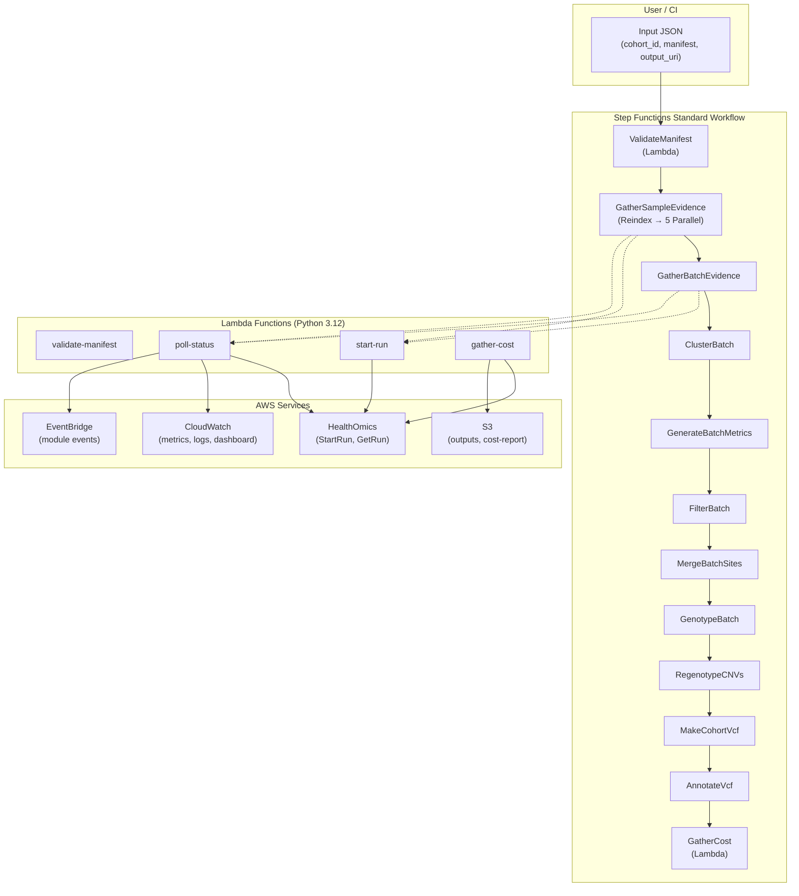
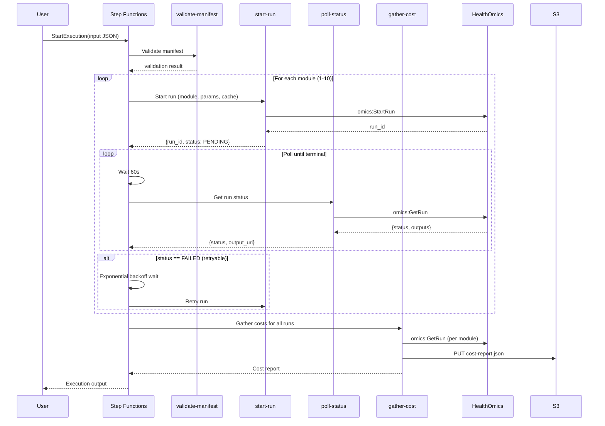
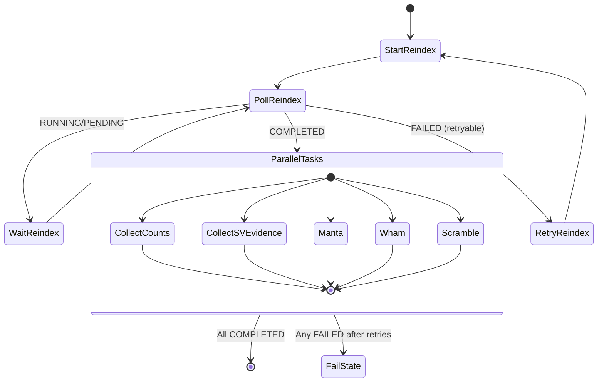

# Design Document

## Overview

This design describes an AWS Step Functions Standard Workflow that orchestrates the 10-module GATK-SV pipeline on AWS HealthOmics. The orchestrator replaces the existing `submit_cohort()` function (which submits all modules but does not wait/poll) with a durable, fault-tolerant execution engine. Users submit a sample manifest and the state machine handles validation, sequential module chaining, the GatherSampleEvidence parallel fan-out, polling, retries with exponential backoff, and cost reporting — all without requiring a user's machine to stay online.

The system is deployed as a single CDK stack containing:
- One Step Functions Standard Workflow (state machine)
- Four Lambda functions (validate-manifest, start-run, poll-status, gather-cost)
- IAM roles scoped to least-privilege
- A CloudWatch dashboard for observability

All resources deploy to a configurable target region (default `ap-southeast-1`) in account `__ACCOUNT_ID__`.

## Architecture

### High-Level Component Topology



### State Machine Execution Flow



### GatherSampleEvidence Fan-Out Pattern



## Components and Interfaces

### Lambda: validate-manifest

**Purpose:** Validates the sample manifest before any HealthOmics runs are submitted. Provides fast feedback on input errors.

**Trigger:** Invoked as the first Task state in the state machine.

**Input:**
```json
{
  "cohort_id": "string",
  "sample_manifest": { "samples": [...] } | "s3://bucket/manifest.json",
  "output_uri": "s3://bucket/prefix",
  "target_region": "ap-southeast-1"
}
```

**Validation Rules:**
1. Schema validation — required fields present, correct types
2. Duplicate sample IDs — reject with list of duplicates
3. Region check — all reads/index URIs must be in target region (S3 bucket region lookup)
4. Format check — only CRAM+CRAI or BAM+BAI pairs accepted

**Output (success):**
```json
{
  "validation_status": "PASSED",
  "sample_count": 5,
  "manifest": { ... }
}
```

**Output (failure):**
```json
{
  "validation_status": "FAILED",
  "errors": [
    {"sample_id": "NA12878", "rule": "duplicate_id", "detail": "appears 2 times"},
    {"sample_id": "NA12879", "rule": "out_of_region", "detail": "bucket in us-east-1"}
  ]
}
```

**Runtime:** Python 3.12, 256 MB, 60s timeout.

### Lambda: start-run

**Purpose:** Submits a single HealthOmics workflow run with the correct parameters, cache configuration, and cost-tracking tags.

**Trigger:** Invoked by the state machine for each module (and each parallel task in GatherSampleEvidence).

**Input:**
```json
{
  "module": "GatherBatchEvidence",
  "workflow_id": "1234567",
  "workflow_version_name": "v1.0.0",
  "parameters": { ... },
  "output_uri": "s3://bucket/runs/cohort-1/GatherBatchEvidence/",
  "cohort_id": "cohort-1",
  "sample_count": 5,
  "attempt_number": 1
}
```

**Behavior:**
- Reads `HEALTHOMICS_ROLE_ARN` from environment (not from input — security requirement 12.4)
- Reads `CACHE_ID` from environment (default: `9564200`)
- Always sets `cacheBehavior: CACHE_ALWAYS`
- Always sets `storageType: DYNAMIC`
- Applies cost-tracking tags: `gatk-sv:cohort-id`, `gatk-sv:workflow-version`, `gatk-sv:module`, `gatk-sv:sample-count`
- Calls `omics:StartRun`

**Output:**
```json
{
  "run_id": "9876543",
  "arn": "arn:aws:omics:ap-southeast-1:__ACCOUNT_ID__:run/9876543",
  "status": "PENDING",
  "module": "GatherBatchEvidence",
  "attempt_number": 1
}
```

**Runtime:** Python 3.12, 256 MB, 60s timeout.

### Lambda: poll-status

**Purpose:** Checks the status of a HealthOmics run and returns structured status information for the state machine's Choice state.

**Trigger:** Invoked after each 60-second Wait state in the polling loop.

**Input:**
```json
{
  "run_id": "9876543",
  "module": "GatherBatchEvidence",
  "cohort_id": "cohort-1",
  "attempt_number": 1
}
```

**Behavior:**
- Calls `omics:GetRun` with the run_id
- Extracts status, output URI, failure reason (if failed), and cache status
- Emits structured CloudWatch log with execution context
- On COMPLETED/FAILED: publishes EventBridge event, emits CloudWatch metrics

**Output:**
```json
{
  "run_id": "9876543",
  "status": "COMPLETED",
  "output_uri": "s3://bucket/runs/cohort-1/GatherBatchEvidence/9876543/",
  "is_terminal": true,
  "is_cache_hit": false,
  "failure_reason": null,
  "error_code": null,
  "duration_seconds": 3600
}
```

**Runtime:** Python 3.12, 256 MB, 60s timeout.

### Lambda: gather-cost

**Purpose:** Collects cost data from all completed module runs and produces the final cost report.

**Trigger:** Invoked as the terminal step after all modules complete (or on pipeline failure for partial report).

**Input:**
```json
{
  "cohort_id": "cohort-1",
  "sample_count": 5,
  "output_uri": "s3://bucket/runs/cohort-1/",
  "module_runs": [
    {"module": "GatherSampleEvidence", "run_id": "111", "status": "COMPLETED", "is_cache_hit": false},
    {"module": "GatherBatchEvidence", "run_id": "222", "status": "COMPLETED", "is_cache_hit": true}
  ]
}
```

**Behavior:**
- For each module run, calls `omics:GetRun` to retrieve billing/cost metadata
- Computes per-module cost, total cost, per-sample cost
- Includes cache hit/miss status per module
- Writes `cost-report.json` to `{output_uri}/cost-report.json`
- Returns the cost report as output

**Output:**
```json
{
  "cohort_id": "cohort-1",
  "sample_count": 5,
  "total_cost_usd": 32.50,
  "per_sample_cost_usd": 6.50,
  "modules": [
    {"module": "GatherSampleEvidence", "run_id": "111", "cost_usd": 8.20, "is_cache_hit": false, "duration_seconds": 7200},
    {"module": "GatherBatchEvidence", "run_id": "222", "cost_usd": 0.00, "is_cache_hit": true, "duration_seconds": 5}
  ],
  "cost_report_uri": "s3://bucket/runs/cohort-1/cost-report.json"
}
```

**Runtime:** Python 3.12, 256 MB, 60s timeout.

### CDK Stack: GatkSvOrchestratorStack

**Purpose:** Synthesizes all infrastructure into a single deployable CloudFormation stack.

**Configurable Parameters (via CDK context or constructor props):**
- `target_region` — AWS region (default: `ap-southeast-1`)
- `healthomics_role_arn` — IAM role for HealthOmics runs (default: `arn:aws:iam::__ACCOUNT_ID__:role/gatk-sv-healthomics-run-role`)
- `cache_id` — Run cache ID (default: `9564200`)
- `output_bucket` — S3 bucket for outputs (default: `healthomics-outputs-__ACCOUNT_ID__-apse1`)

**Resources Created:**
1. `StateMachine` — Step Functions Standard Workflow with the full ASL definition
2. `ValidateManifestFunction` — Lambda for manifest validation
3. `StartRunFunction` — Lambda for HealthOmics run submission
4. `PollStatusFunction` — Lambda for run status polling
5. `GatherCostFunction` — Lambda for cost report generation
6. `StateMachineRole` — IAM role for the state machine (lambda:InvokeFunction only)
7. `LambdaExecutionRole` — Shared IAM role for Lambda functions (scoped permissions)
8. `PipelineDashboard` — CloudWatch dashboard

## Data Models

### State Machine Input

```json
{
  "cohort_id": "string (required)",
  "sample_manifest": "object | s3-uri (required)",
  "output_uri": "s3://bucket/prefix (required)",
  "overrides": {
    "storage_type": "DYNAMIC | STATIC (optional, default DYNAMIC)",
    "cache_id": "string (optional, default from stack param)",
    "networking_mode": "RESTRICTED | VPC (optional, default RESTRICTED)"
  }
}
```

Note: `role_arn` is intentionally NOT in the input. The HealthOmics run role is configured as a stack parameter and injected into the start-run Lambda via environment variable (Requirement 12.4).

### State Machine Output (Success)

```json
{
  "cohort_id": "string",
  "status": "COMPLETED",
  "module_runs": [
    {"module": "GatherSampleEvidence", "run_id": "111", "duration_seconds": 7200, "is_cache_hit": false}
  ],
  "total_cost_usd": 32.50,
  "per_sample_cost_usd": 6.50,
  "output_uri": "s3://bucket/prefix",
  "duration_seconds": 86400,
  "cost_report_uri": "s3://bucket/prefix/cost-report.json"
}
```

### State Machine Output (Failure)

```json
{
  "cohort_id": "string",
  "status": "FAILED",
  "failed_module": "ClusterBatch",
  "failed_run_id": "333",
  "error_message": "OutOfMemoryError: task exceeded memory limit",
  "error_code": "OutOfMemoryError",
  "retry_attempts": 3,
  "completed_modules": [
    {"module": "GatherSampleEvidence", "run_id": "111"},
    {"module": "GatherBatchEvidence", "run_id": "222"}
  ],
  "partial_cost_report": { ... }
}
```

### Cost Report (written to S3)

```json
{
  "cohort_id": "string",
  "sample_count": 5,
  "total_cost_usd": 32.50,
  "per_sample_cost_usd": 6.50,
  "modules": [
    {
      "module": "GatherSampleEvidence",
      "run_id": "111",
      "cost_usd": 8.20,
      "duration_seconds": 7200,
      "is_cache_hit": false
    }
  ],
  "generated_at": "2026-06-01T12:00:00Z"
}
```

### Module Execution Context (passed between states)

```json
{
  "cohort_id": "string",
  "sample_count": 5,
  "output_uri": "s3://bucket/prefix",
  "current_module_index": 2,
  "module_runs": [
    {"module": "GatherSampleEvidence", "run_id": "111", "status": "COMPLETED", "output_uri": "s3://...", "is_cache_hit": false, "duration_seconds": 7200}
  ],
  "attempt_number": 1
}
```

### ASL Structure (Simplified)

The state machine ASL follows this pattern for each module:

```json
{
  "StartAt": "ValidateManifest",
  "States": {
    "ValidateManifest": {
      "Type": "Task",
      "Resource": "arn:aws:lambda:...:validate-manifest",
      "Next": "Module_GatherSampleEvidence",
      "Catch": [{"ErrorEquals": ["States.ALL"], "Next": "PipelineFailed"}]
    },
    "Module_GatherSampleEvidence": {
      "Type": "Task",
      "Comment": "Special: reindex then 5 parallel tasks",
      "Resource": "arn:aws:states:::states:startExecution.sync",
      "Next": "Module_GatherBatchEvidence"
    },
    "Module_GatherBatchEvidence": {
      "Type": "Parallel",
      "Branches": [{"StartAt": "StartRun_GBE", "States": {"StartRun_GBE": "...", "PollLoop_GBE": "..."}}],
      "Next": "Module_ClusterBatch",
      "Retry": [{"ErrorEquals": ["RetryableError"], "MaxAttempts": 3, "IntervalSeconds": 30, "BackoffRate": 2, "MaxDelaySeconds": 480}],
      "Catch": [{"ErrorEquals": ["States.ALL"], "Next": "PipelineFailed"}]
    }
  }
}
```

Each module's polling loop follows this sub-pattern:

```
StartRun → Wait(60s) → PollStatus → Choice:
  - COMPLETED → NextModule
  - FAILED/CANCELLED → EvaluateRetry
  - RUNNING/PENDING/STARTING → Wait(60s) (loop back)
```

### Retry Configuration

| Parameter | Value |
|-----------|-------|
| Max attempts | 3 |
| Base interval | 30 seconds |
| Backoff factor | 2x |
| Max delay | 8 minutes (480s) |
| Retryable errors | InternalServerError, Throttling, ServiceUnavailable |

Backoff schedule: attempt 1 → 30s, attempt 2 → 60s, attempt 3 → 120s (all under 480s cap).

### IAM Role Design

**State Machine Execution Role:**
- `lambda:InvokeFunction` on the 4 Lambda function ARNs
- `logs:CreateLogDelivery`, `logs:GetLogDelivery` for execution logging

**Lambda Execution Role (shared):**
- `omics:StartRun` — scoped to account
- `omics:GetRun` — scoped to account
- `omics:ListRunTasks` — scoped to account
- `s3:PutObject` — scoped to output bucket prefix (`cost-report.json`)
- `s3:GetObject` — scoped to output bucket (for manifest resolution from S3)
- `s3:GetBucketLocation` — for region validation
- `logs:CreateLogGroup`, `logs:CreateLogStream`, `logs:PutLogEvents` — for Lambda logging
- `cloudwatch:PutMetricData` — for custom metrics
- `events:PutEvents` — for EventBridge events

The Lambda does NOT assume the HealthOmics run role. It passes `role_arn` to `StartRun` as a parameter — HealthOmics assumes that role internally.


## Correctness Properties

*A property is a characteristic or behavior that should hold true across all valid executions of a system — essentially, a formal statement about what the system should do. Properties serve as the bridge between human-readable specifications and machine-verifiable correctness guarantees.*

### Property 1: Manifest validation catches all invalid inputs

*For any* sample manifest containing duplicate sample IDs, out-of-region URIs, or unsupported file formats (not CRAM+CRAI or BAM+BAI), the validation function SHALL return at least one error identifying the specific violation, and the error list SHALL be non-empty.

**Validates: Requirements 2.2, 2.3, 2.4**

### Property 2: Valid manifests pass validation

*For any* sample manifest where all sample IDs are unique, all URIs are in the target region, and all file pairs are CRAM+CRAI or BAM+BAI, the validation function SHALL return an empty error list.

**Validates: Requirements 2.5**

### Property 3: Retry classification correctness

*For any* error code and attempt number, the retry classifier SHALL return `should_retry=True` if and only if the error code is in {InternalServerError, Throttling, ServiceUnavailable} AND the attempt number is strictly less than 3. For all other combinations, it SHALL return `should_retry=False`.

**Validates: Requirements 5.1, 5.3**

### Property 4: Exponential backoff formula

*For any* attempt number in {1, 2, 3}, the computed backoff delay SHALL equal `min(30 * 2^(attempt-1), 480)` seconds. The delay SHALL never exceed 480 seconds regardless of attempt number.

**Validates: Requirements 5.2**

### Property 5: Run submission always includes cache and tags

*For any* valid module name, cohort_id, workflow_version, and sample_count, the run submission parameters produced by the start-run function SHALL always include `cache_id`, `cache_behavior=CACHE_ALWAYS`, and all four cost-tracking tags (`gatk-sv:cohort-id`, `gatk-sv:workflow-version`, `gatk-sv:module`, `gatk-sv:sample-count`).

**Validates: Requirements 6.1, 7.3**

### Property 6: Cost report arithmetic

*For any* non-empty list of module run costs and a positive sample count, the cost report SHALL satisfy: `total_cost_usd == sum(module_costs)` and `per_sample_cost_usd == total_cost_usd / sample_count`. The per_sample_cost_usd SHALL always be non-negative.

**Validates: Requirements 7.2**

### Property 7: Cost report path construction

*For any* valid output URI (with or without trailing slash), the cost report S3 key SHALL be constructed as `{output_uri}/cost-report.json` (with exactly one slash separator, no double slashes).

**Validates: Requirements 7.4**

### Property 8: Input schema validation

*For any* input JSON containing all required fields (`cohort_id`, `sample_manifest`, `output_uri`) with valid types, schema validation SHALL pass. *For any* input JSON missing any required field, schema validation SHALL fail with an error identifying the missing field.

**Validates: Requirements 9.1, 9.4**

### Property 9: Output structure matches terminal state

*For any* successful pipeline execution (all modules COMPLETED), the output JSON SHALL contain all required success fields: `cohort_id`, `status=COMPLETED`, `module_runs` (length 10), `total_cost_usd`, `per_sample_cost_usd`, `output_uri`, `duration_seconds`. *For any* failed pipeline execution, the output JSON SHALL contain all required failure fields: `cohort_id`, `status=FAILED`, `failed_module`, `failed_run_id`, `error_message`, `retry_attempts`.

**Validates: Requirements 9.2, 9.3**

### Property 10: Structured logging completeness

*For any* Lambda invocation with execution context (cohort_id, current_module, attempt_number), every log entry produced SHALL contain all three context fields as structured key-value pairs.

**Validates: Requirements 10.3**

## Error Handling

### Error Categories

| Category | Examples | Handling |
|----------|----------|----------|
| Validation errors | Invalid manifest, missing fields, bad schema | Immediate failure with descriptive error. No HealthOmics runs submitted. |
| Retryable HealthOmics errors | InternalServerError, Throttling, ServiceUnavailable | Retry up to 3 times with exponential backoff (30s base, 2x, 480s cap). |
| Non-retryable HealthOmics errors | InvalidParameterException, ResourceNotFoundException | Immediate failure. Preserve completed module outputs. |
| Lambda invocation errors | Timeout, throttling, unhandled exception | Caught by Step Functions Catch block. Treated as pipeline failure. |
| Module timeout | Single module exceeds 24 hours | Cancel in-progress HealthOmics run. Transition to failure state. |

### Catch Block Strategy

Every Task state that invokes a Lambda has a Catch block:
```json
{
  "Catch": [
    {
      "ErrorEquals": ["States.TaskFailed", "States.Timeout"],
      "Next": "HandleModuleFailure",
      "ResultPath": "$.error"
    }
  ]
}
```

The `HandleModuleFailure` state evaluates whether the error is retryable and routes to either retry (with backoff wait) or pipeline failure.

### Failure Output Preservation

When the pipeline fails at module N:
- Modules 1 through N-1 have already written outputs to S3 (immutable)
- The failure output includes `completed_modules` with their run IDs and output URIs
- Re-running the pipeline with the same inputs leverages the run cache (CACHE_ALWAYS) to skip completed modules
- No cleanup or rollback of prior module outputs occurs

### Module Timeout (24-hour guard)

Each module's polling loop tracks elapsed time. If a single module exceeds 24 hours:
1. The poll-status Lambda detects the timeout condition
2. Returns a special `MODULE_TIMEOUT` status
3. The state machine transitions to a cancellation step
4. Cancellation step calls `omics:CancelRun` on the in-progress run
5. Pipeline transitions to failure state with timeout error

## Testing Strategy

### Property-Based Tests (Hypothesis, Python)

Property-based testing is appropriate for this feature because the core logic (validation, retry classification, backoff calculation, parameter building, cost arithmetic) consists of pure functions with clear input/output behavior and large input spaces.

**Library:** [Hypothesis](https://hypothesis.readthedocs.io/) for Python

**Configuration:** Minimum 100 iterations per property test.

**Tag format:** `Feature: step-functions-orchestrator, Property {N}: {title}`

Properties to implement:
1. Manifest validation (Properties 1, 2) — generate random manifests with/without violations
2. Retry classifier (Property 3) — generate random error codes and attempt numbers
3. Backoff formula (Property 4) — generate random attempt numbers
4. Run submission completeness (Property 5) — generate random module/cohort combinations
5. Cost report arithmetic (Property 6) — generate random cost lists and sample counts
6. Cost report path (Property 7) — generate random S3 URIs
7. Input schema validation (Property 8) — generate random input JSONs
8. Output structure (Property 9) — generate random execution results
9. Structured logging (Property 10) — generate random execution contexts

### Unit Tests (pytest)

Unit tests cover specific examples and edge cases:
- Empty manifest (0 samples) → validation error
- Manifest with exactly 1 sample → passes
- Retry with attempt_number = 0 → should_retry=True (first attempt)
- Retry with attempt_number = 3 → should_retry=False (exhausted)
- Cost report with all cache hits → total_cost = 0
- GatherSampleEvidence fan-out: one branch fails → entire module fails
- Module timeout at exactly 24 hours boundary

### CDK Snapshot / Assertion Tests

- Synthesized template contains StateMachineType: STANDARD
- All Lambda functions use Python 3.12 runtime
- Lambda timeout = 60s, memory = 256 MB
- IAM policies contain no wildcard (*) resources
- State machine role has only lambda:InvokeFunction
- CloudWatch dashboard resource exists
- Stack accepts configurable parameters (region, role ARN, cache ID, bucket)

### Integration Tests

- End-to-end: submit a 1-sample cohort, verify pipeline completes and produces cost report
- Cached re-run: submit same cohort again, verify cache hits and faster completion
- Validation failure: submit manifest with duplicate IDs, verify fast failure
- EventBridge events: verify events published on module transitions
- CloudWatch metrics: verify custom metrics emitted

