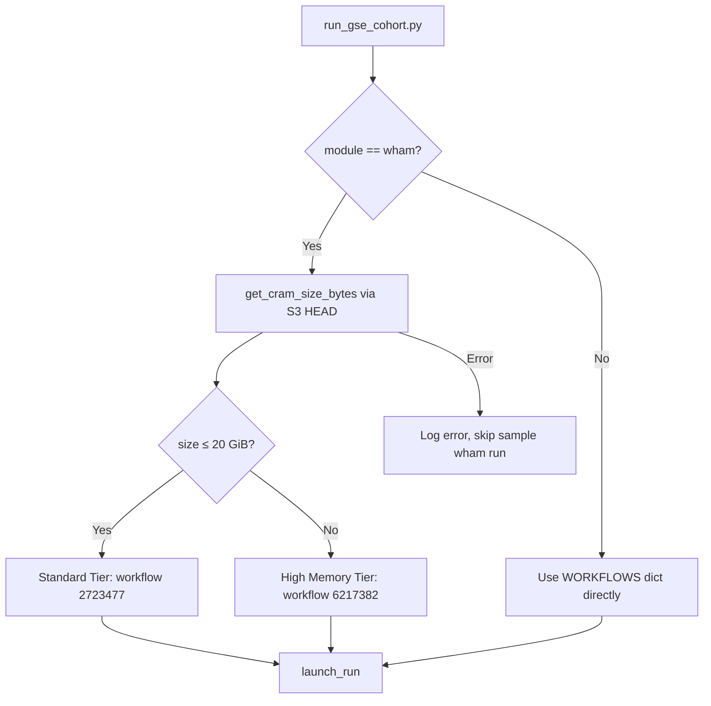

# Design Document: Tiered Wham Memory Provisioning

## Overview

This feature adds tiered memory provisioning to the `run_gse_cohort.py` orchestrator so it automatically selects the correct wham workflow based on CRAM file size. Two pre-deployed HealthOmics workflows exist with identical parameter interfaces but different memory allocations:

- **Standard Tier** (workflow `2723477`): 16 GiB memory — for CRAMs ≤ 20 GiB
- **High Memory Tier** (workflow `6217382`): 30 GiB memory — for CRAMs > 20 GiB

The orchestrator will issue an S3 HEAD request per sample to determine CRAM size, select the appropriate tier, log the decision, and record the chosen workflow ID in the run manifest.

**Design Rationale**: HealthOmics does not support dynamic memory allocation via WDL runtime parameters — the memory is baked into the workflow definition at registration time. Therefore two separate workflow registrations are required, and the orchestrator must route each sample to the correct one.

## Architecture



The tiered selection is isolated to the wham module path. All other modules (manta, cc, scramble, cse) continue through the existing single-ID lookup unchanged.

## Components and Interfaces

### 1. Module-Level Constants

```python
# Threshold in bytes (20 GiB)
WHAM_SIZE_THRESHOLD_BYTES: int = 21_474_836_480

# Tiered wham workflow configuration
WHAM_TIERS = {
    "standard": {
        "id": "2723477",
        "memory_gib": 16,
        "label": "Standard_Tier",
    },
    "high_memory": {
        "id": "6217382",
        "memory_gib": 30,
        "label": "High_Memory_Tier",
    },
}
```

The existing `WORKFLOWS["wham"]` entry retains `storage_type` and `storage_capacity` (shared across both tiers). The workflow ID is resolved dynamically at launch time.

### 2. `get_cram_size_bytes(s3_client, bucket, key) -> int`

Issues an S3 `head_object` call and returns `ContentLength`.

**Interface:**
```python
def get_cram_size_bytes(s3_client, bucket: str, key: str) -> int:
    """Return the size in bytes of an S3 object via HEAD request.
    
    Raises:
        botocore.exceptions.ClientError on S3 failures (404, 403, etc.)
    """
```

### 3. `select_wham_tier(size_bytes: int, threshold: int = WHAM_SIZE_THRESHOLD_BYTES) -> dict`

Pure function that returns the appropriate tier config dict based on file size.

**Interface:**
```python
def select_wham_tier(size_bytes: int, threshold: int = WHAM_SIZE_THRESHOLD_BYTES) -> dict:
    """Select the wham tier based on CRAM file size.
    
    Args:
        size_bytes: CRAM file size in bytes (must be >= 0).
        threshold: Size boundary in bytes. Defaults to 20 GiB.
    
    Returns:
        Tier dict with keys: id, memory_gib, label
    """
```

### 4. Modified `launch_run` Flow (wham path)

When `module == "wham"`:
1. Derive bucket/key from `COHORT_BASE` and `sample_id`
2. Call `get_cram_size_bytes`
3. Call `select_wham_tier` with the returned size
4. Log tier selection: `f"[{sample_id}] CRAM {size_gib:.1f} GiB → {tier['label']} (workflow {tier['id']})"`
5. Override `wf["id"]` with the tier's workflow ID
6. Include `workflow_id` and `tier` in the run result dict

On S3 error:
1. Log: `f"[{sample_id}] ERROR: Failed to query CRAM size: {error}. Skipping wham."`
2. Return `None` (caller skips appending to `launched`)

### 5. WORKFLOWS Dict Restructure

```python
WORKFLOWS = {
    "wham": {
        "id": "2723477",           # default/fallback (standard tier)
        "storage_type": "STATIC",
        "storage_capacity": 1200,
        "tiered": True,            # signals that tier selection applies
    },
    # manta, cc, scramble, cse unchanged...
}
```

The `"tiered": True` flag tells `launch_run` to invoke the tier selection path. This keeps the dict backward-compatible — non-tiered modules ignore the flag.

## Data Models

### Tier Configuration

```python
TierConfig = TypedDict("TierConfig", {
    "id": str,           # HealthOmics workflow ID
    "memory_gib": int,   # Memory allocation in GiB
    "label": str,        # Human-readable tier name
})
```

### Run Result (extended for wham)

The run result dict returned by `launch_run` gains two optional fields when the module is wham:

```python
{
    "id": "run-abc123",
    "name": "wham-NA12878",
    "module": "wham",
    "sample": "NA12878",
    "workflow_id": "6217382",          # NEW: actual workflow ID used
    "tier": "High_Memory_Tier",        # NEW: tier label
}
```

Non-wham modules omit these fields (backward-compatible).

### Run Manifest JSON (gse-cohort-runs.json)

No structural change to the top-level schema. The per-run objects in the `"runs"` array gain the `workflow_id` and `tier` fields for wham entries only.


## Correctness Properties

*A property is a characteristic or behavior that should hold true across all valid executions of a system — essentially, a formal statement about what the system should do. Properties serve as the bridge between human-readable specifications and machine-verifiable correctness guarantees.*

### Property 1: GiB Conversion Correctness

*For any* non-negative integer `size_bytes`, converting to GiB via `size_bytes / (1024**3)` and then back via `gib * (1024**3)` SHALL produce a value within floating-point tolerance of the original `size_bytes`.

**Validates: Requirements 1.2**

### Property 2: Tier Selection Partition

*For any* non-negative integer `size_bytes` and positive integer `threshold`, `select_wham_tier(size_bytes, threshold)` SHALL return the Standard_Tier configuration when `size_bytes <= threshold`, and the High_Memory_Tier configuration when `size_bytes > threshold`.

**Validates: Requirements 2.1, 2.2**

### Property 3: Parameter Interface Invariant

*For any* valid `sample_id` string, the set of parameter keys returned by `build_params("wham", sample_id)` SHALL be identical regardless of which tier is selected — the tier selection affects only the workflow ID, not the parameter payload.

**Validates: Requirements 2.3**

### Property 4: Log Message Completeness

*For any* `sample_id` string and non-negative `size_bytes`, the tier selection log message SHALL contain: (a) the `sample_id`, (b) the CRAM size in GiB rounded to one decimal place, and (c) the tier label matching the selected tier.

**Validates: Requirements 3.1**

### Property 5: Manifest Workflow ID Correctness

*For any* wham run result produced by `launch_run`, the `workflow_id` field SHALL equal the `id` of the tier returned by `select_wham_tier` for that sample's CRAM size.

**Validates: Requirements 3.2**

## Error Handling

| Scenario | Behavior | Recovery |
|----------|----------|----------|
| S3 HEAD returns 404 (CRAM not found) | Log error with sample_id and "NoSuchKey" reason | Skip sample's wham run, continue batch |
| S3 HEAD returns 403 (access denied) | Log error with sample_id and "AccessDenied" reason | Skip sample's wham run, continue batch |
| S3 HEAD times out or network error | Log error with sample_id and exception message | Skip sample's wham run, continue batch |
| `size_bytes` is 0 (empty CRAM) | Treat as valid — selects Standard_Tier (0 ≤ threshold) | Proceed normally; wham will likely fail on empty input but that's a workflow-level error |
| Non-wham module encounters any issue | Unchanged from current behavior | Existing error propagation |

**Design Decision**: Errors in CRAM size lookup are non-fatal to the batch. The orchestrator logs the failure and skips only the affected sample's wham run. This prevents a single missing/inaccessible CRAM from blocking the entire cohort.

## Testing Strategy

### Property-Based Tests (Hypothesis)

The project already uses Hypothesis (`.hypothesis/` directory present). Each correctness property maps to a single property-based test with minimum 100 iterations.

**Library**: `hypothesis` (Python)
**Test file**: `tests/gatk_sv_healthomics/unit/test_tiered_wham.py`

| Property | Test | Generator Strategy |
|----------|------|-------------------|
| Property 1: GiB Conversion | `test_gib_conversion_round_trip` | `st.integers(min_value=0, max_value=100 * 1024**3)` |
| Property 2: Tier Selection Partition | `test_tier_selection_partition` | `st.integers(min_value=0, max_value=100 * 1024**3)` combined with `st.integers(min_value=1, max_value=50 * 1024**3)` for threshold |
| Property 3: Parameter Interface Invariant | `test_param_keys_invariant` | `st.text(min_size=1, max_size=50, alphabet=st.characters(whitelist_categories=('L', 'N')))` for sample_id |
| Property 4: Log Message Completeness | `test_log_message_completeness` | `st.tuples(st.text(min_size=1, max_size=30), st.integers(min_value=0, max_value=100 * 1024**3))` |
| Property 5: Manifest Workflow ID | `test_manifest_workflow_id_correctness` | `st.integers(min_value=0, max_value=100 * 1024**3)` |

**Configuration**: Each test decorated with `@settings(max_examples=100)`.

**Tag format**: `# Feature: tiered-wham-memory, Property {N}: {title}`

### Unit Tests (Example-Based)

| Test | Validates |
|------|-----------|
| `test_s3_head_called_for_wham` | Req 1.1 — verifies HEAD request is issued |
| `test_s3_error_skips_sample` | Req 1.3 — verifies error handling and skip |
| `test_non_wham_no_s3_call` | Req 4.1 — verifies no S3 call for other modules |
| `test_non_wham_params_unchanged` | Req 4.2 — regression test for other modules |
| `test_threshold_constant_value` | Req 2.4 — verifies constant is 21474836480 |
| `test_head_not_get` | Req 5.1 — verifies HEAD (not GET) is used |
| `test_single_head_per_sample` | Req 5.2 — verifies at-most-once query |

### Integration Tests

Not required for this feature — the S3 interaction is mocked in unit/property tests, and the HealthOmics workflow IDs are verified to exist via existing CI checks.
