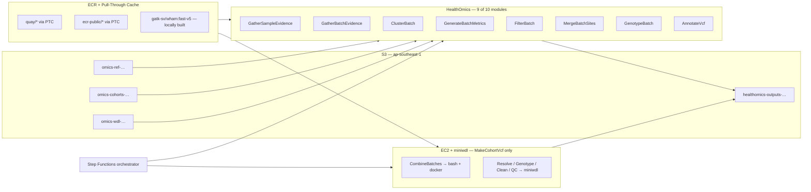

# gatk-sv-aws

Production migration of the [Broad Institute GATK-SV](https://github.com/broadinstitute/gatk-sv) structural-variant pipeline from Terra/Cromwell-on-GCP to AWS HealthOmics in Singapore (`ap-southeast-1`).

End-to-end joint cohort calling for short-read germline samples — `GatherSampleEvidence` → `AnnotateVcf` — running natively on AWS managed services, with a documented hybrid path for one module that hits a HealthOmics service-level issue.

## Contents

- [Status](#status) — what's verified, what's pending
- [Quick start](#quick-start) — env, install, test, submit one cohort
- [Architecture](#architecture) — module-to-AWS-service mapping diagram
- [Setup](#setup) — placeholders, IAM, buckets, naming conventions
- [How each module is ported](#how-each-module-is-ported) — workflow IDs, bundles, divergence counts
- [Container images](#container-images) — 12 ECR mirrors + custom Wham build
- [Reference bundle](#reference-bundle) — 28 files, 19.7 GiB, staging procedure
- [End-to-end bring-up](#end-to-end-bring-up) — 15 steps for a fresh account/region
- [The HealthOmics 47-second kill](#the-healthomics-47-second-kill) — open AWS service issue + workaround
- [WDL antipatterns we patched](#wdl-antipatterns-we-patched) — Cromwell vs miniwdl
- [Validation](#validation) — strict / fuzzy / cross-engine concordance
- [Cost & runtime expectations](#cost--runtime-expectations) — $7/sample target, 14–22 hr for 100 samples
- [Operations](#operations) — cache invalidation, rollback, monitoring
- [Troubleshooting](#troubleshooting) — common failure modes
- [Repository layout](#repository-layout)
- [Spec & docs index](#spec--docs-index) — Kiro specs and operational docs
- [Key constants](#key-constants)
- [Out of scope / known limitations](#out-of-scope--known-limitations)
- [Tests](#tests) — 212 unit + property + integration + acceptance
- [Provenance](#provenance)
- [License](#license)


## Status

| Cohort scale tested | 10 samples (GRCh38) |
|---|---|
| End-to-end run | ✅ COMPLETE |
| Final cohort VCF | 18,703 SVs (DEL=9635, INS=4485, DUP=2682, BND=1728, CPX=145, CNV=28) |
| Cross-engine bit-identity (HealthOmics vs miniwdl) | ✅ Verified for Manta on NA12878 (body MD5 match) |
| Strict + fuzzy concordance vs Broad reference | ⏳ Pending Terra reference run |
| Per-sample cost target | USD $7.00 — measured via Cost Explorer tags |
| HealthOmics regions supported | 8 (`get_supported_regions`); we run in `ap-southeast-1` |
| Open AWS service issue | HealthOmics 47s kill on `gatk GroupedSVCluster` / `svtk resolve` inside deeply nested workflows — see [§The HealthOmics 47-second kill](#the-healthomics-47-second-kill) |

## Quick start

For a customer deploying into their own AWS account from scratch:

```bash
# 1. Set your account/region.
export AWS_ACCOUNT_ID=<your-12-digit-aws-account-id>
export AWS_DEFAULT_REGION=ap-southeast-1   # any HealthOmics region

# 2. Install the Python package.
python3.11 -m venv .venv
.venv/bin/pip install -e 'python/[dev]'

# 3. Bootstrap the AWS account (one-time per account+region; ~30-60 min, ~$5 spend).
.venv/bin/python scripts/bootstrap/00_substitute_placeholders.py
.venv/bin/python scripts/bootstrap/01_create_buckets.py
.venv/bin/python scripts/bootstrap/02_stage_reference.py
.venv/bin/python scripts/bootstrap/03_setup_ecr.py
.venv/bin/python scripts/bootstrap/04_build_wham.py
.venv/bin/python scripts/bootstrap/05_create_iam_role.py
.venv/bin/python scripts/bootstrap/06_create_run_cache.py        # outputs the run cache id
.venv/bin/python scripts/bootstrap/07_provision_ec2_hybrid.py    # outputs the EC2 instance id
.venv/bin/python scripts/bootstrap/08_register_workflows.py      # writes workflow-ids.json

export GATK_SV_RUN_CACHE_ID=<from step 6>
export GATK_SV_EC2_INSTANCE_ID=<from step 7>

.venv/bin/python scripts/bootstrap/09_validate.py                # sanity check

# 4. Verify the unit + property tests pass on your machine (~22s).
.venv/bin/python -m pytest python/tests/unit python/tests/properties -q

# 5. Submit a cohort end-to-end.
.venv/bin/python scripts/run_cohort_e2e.py \
    --cohort-id my-cohort-2026q3 \
    --manifest validation-cohort/inputs/manifest.json
```

For details on each bootstrap step (and how to tear everything down), see [`scripts/bootstrap/README.md`](scripts/bootstrap/README.md).

## Architecture



**Key design choices:**

- **One HealthOmics workflow per upstream GATK-SV module.** Lint, right-size, and version-bump independently. Chained by an orchestrator (Step Functions or `scripts/run_pipeline.py`).
- **Account-agnostic.** Every reference to an AWS account ID has been replaced with the placeholder `__ACCOUNT_ID__`. Scripts read `AWS_ACCOUNT_ID` from the env; JSON configs need `sed`-substitution before applying.
- **RESTRICTED networking by default.** Task containers have no outbound network access. All reference and container traffic stays intra-region via S3 VPC endpoints and ECR pull-through caches.
- **DYNAMIC storage by default.** STATIC storage (1200 GiB chunks) only if a single cohort exceeds 1 TiB inputs.
- **Run cache `CACHE_ALWAYS`.** Re-runs after partial failure pay only for new tasks.
- **Cost attribution by tag.** Every resource carries `gatk-sv:cohort-id`, `gatk-sv:workflow-version`, `gatk-sv:module`, `gatk-sv:sample-count`. Per-cohort spend is queryable in Cost Explorer.

## Setup

### Account & region placeholders

This repo is account-agnostic. Every literal AWS account ID has been replaced with the placeholder `__ACCOUNT_ID__` so you can drop the repo into any account without leaking ours.

**Before running any script:**

```bash
export AWS_ACCOUNT_ID=<your-12-digit-aws-account-id>
export AWS_DEFAULT_REGION=ap-southeast-1   # or another HealthOmics-supported region
```

The Python and shell launch scripts read `AWS_ACCOUNT_ID` from the environment. Python scripts fall back to the literal string `__ACCOUNT_ID__` (so imports and `--help` work without the env var); shell scripts fail fast with a clear message if the var is missing.

**JSON config files** under `iam/policies/`, `parameter-templates/`, `container-registry-map/`, `reference-bundle/`, `validation-cohort/inputs/`, and the run-record JSONs at the repo root still contain the literal `__ACCOUNT_ID__` placeholder. Substitute before applying — see the Quick Start `sed` line.

**Dockerfiles** under `wham-patch/` use a build arg:

```bash
docker build --build-arg ACCOUNT_ID=$AWS_ACCOUNT_ID -f wham-patch/Dockerfile .
```

**Bucket names and EC2 instance IDs** (`omics-ref-…`, `omics-cohorts-…`, `healthomics-outputs-…`, `i-02c67bb34211a85ed`) reflect our environment and need to be updated to match yours — see [§Key constants](#key-constants).

### Buckets

Four S3 buckets, all in `ap-southeast-1`:

| Purpose | Bucket pattern |
|---|---|
| Reference bundle | `omics-ref-ap-southeast-1-<account-id>` |
| Cohort inputs (CRAM/CRAI) | `omics-cohorts-ap-southeast-1-<account-id>` |
| WDL ZIPs (HealthOmics workflow definitions) | `omics-wdl-ap-southeast-1-<account-id>` |
| Run outputs + run cache | `healthomics-outputs-<account-id>-apse1` |

Create them with default encryption + Intelligent-Tiering for the outputs bucket.

### IAM run role

Synthesized least-privilege role, scoped to one region, four bucket prefixes, two ECR repos, and the `omics.amazonaws.com` log group. Trust policy assumes `omics.amazonaws.com`.

```bash
sed -i.bak "s/__ACCOUNT_ID__/$AWS_ACCOUNT_ID/g" iam/policies/*.json

aws iam create-role \
  --role-name gatk-sv-healthomics-run-role \
  --assume-role-policy-document file://iam/policies/gatk-sv-run-role-trust.json

aws iam put-role-policy \
  --role-name gatk-sv-healthomics-run-role \
  --policy-name gatk-sv-run-role \
  --policy-document file://iam/policies/gatk-sv-run-role.json
```

The role passes the IAM-tightness property test (no `Resource: "*"` on writes, no broad action wildcards on S3 / ECR / Logs). See `python/src/gatk_sv_aws/iam/__init__.py:check_broadness`.

## How each module is ported

The Migration System registers **each upstream module as its own HealthOmics workflow**. Workflow IDs below come from the production registration.

| # | GATK-SV module | AWS service | Workflow ID | Bundle | MELT divergences | Notes |
|---|---|---|---|---|---:|---|
| 1 | `GatherSampleEvidence` | HealthOmics | `9690943` | `wdl/bundles/GatherSampleEvidence/GatherSampleEvidence-bundle.zip` | 37 | Per-sample scatter of Manta, Wham, Scramble, GATK-gCNV case-mode, PE/SR/RD/BAF extractors. MELT task removed at packaging. In production we split per-tool (`cc`, `scramble`, `cse`, `manta`, `wham`) for tighter resource control. Memory tiering for Wham (16 GiB / 30 GiB) by CRAM size — see [`tiered-wham-memory`](.kiro/specs/tiered-wham-memory/). |
| 2 | `GatherBatchEvidence` | HealthOmics | `1575165` (v5) | `wdl/bundles/GatherBatchEvidence/GatherBatchEvidence-bundle-v5.zip` | 4 | Cohort-mode gCNV + PE/SR/RD merging. MELT evidence channels dropped. v5 fixes `min/max_interval_size`, array alignment in `discover_gse_outputs`, FUSE-readonly `gunzip` → `zcat`, gCNV memory bumps (60 GiB ploidy, 30 GiB postprocess). |
| 3 | `ClusterBatch` | HealthOmics | `2641017` (v3) | `wdl/bundles/ClusterBatch/ClusterBatch-bundle-v3.zip` | 12 | First clustering pass. MELT input channel removed. v3 adds `gatk IndexFeatureFile` before SVCluster (intermediate VCFs lack `.tbi`), 8 GiB SVCluster memory override. |
| 4 | `GenerateBatchMetrics` | HealthOmics | `5339393` | `wdl/bundles/GenerateBatchMetrics/GenerateBatchMetrics-bundle.zip` | 1 | Per-batch QC metrics. Required uploading proper RepeatMasker + segdups BED tracks. |
| 5 | `FilterBatch` | HealthOmics | `3328339` (v3) | `wdl/bundles/FilterBatch/FilterBatch-bundle-v3.zip` | 9 | Random-forest filtering. v3 fixes array-alignment bug in `FilterBatchSites`/`FilterBatchSamples` (algorithms had 6 elements, vcfs_array had 5), drops empty Scramble VCFs (header-only crashes R plotting), removes redundant `PlotSVCountsPerSample`, sets `run_module_metrics: false` to skip FilterBatchMetrics (requires non-null `depth_vcf`). |
| 6 | `MergeBatchSites` | HealthOmics | `3326995` (v2) | `wdl/bundles/MergeBatchSites/MergeBatchSites-bundle-v2.zip` | 0 | Cross-batch site union. v2 adds `IndexFeatureFile` before SVCluster + 8 GiB SVCluster memory. |
| 7 | `GenotypeBatch` | HealthOmics | `9542089` | `wdl/bundles/GenotypeBatch/GenotypeBatch-bundle.zip` | 0 | Per-batch genotyping. Required replacing 36-byte placeholder `.tbi` files (caused GATK crashes) with proper tabix indexes built via pysam, and using a Picard `.interval_list` for `training_intervals` (BED format and gCNV preprocessed intervals don't work). |
| 8 | `RegenotypeCNVs` | (skipped) | `8299455` | — | — | Skipped for the validation cohort: `GetRegenotype` finds no variants meeting the regenotyping criteria (`regeno_max_allele_freq=0.01`) on a 10-sample run, and the WDL doesn't handle empty output. Safe to re-enable for larger cohorts. |
| 9a | `MakeCohortVcf.CombineBatches` | EC2 + bash | — | `scripts/run_combinebatches_ec2.sh` | 0 | HealthOmics terminates `gatk GroupedSVCluster` at exactly 47s when invoked from inside a multi-import workflow. Single-task diagnostic proves the same call completes in 44s standalone. Workaround: run the same Docker image + arguments on EC2 via SSM. |
| 9b | `MakeCohortVcf.{Resolve,Genotype,Clean,Qc}` | EC2 + miniwdl | — | `wdl/bundles/MakeCohortVcf/MakeCohortVcf-RemainingSteps-bundle-v2.zip` | 0 | The patched WDL bundle runs on EC2 with `miniwdl run` — same engine HealthOmics ships, but on a standard VM that doesn't trigger the kill. Builder applies five upstream-WDL fixes for Cromwell/miniwdl semantic differences. |
| 10 | `AnnotateVcf` | HealthOmics | `6832584` | `wdl/bundles/AnnotateVcf/AnnotateVcf-bundle.zip` | 0 | VEP-style functional consequences + gnomAD-SV allele frequencies (11 populations) + GENCODE. 31 min for 10 samples. |

All 10 packaged bundles lint clean (`LintAHOWorkflowBundle → success`). Total bundle size: 251 KB. Total MELT divergences: 63. The full divergence record is at [`docs/divergence-log.md`](docs/divergence-log.md).

## Container images

12 images mirrored to private ECR with HealthOmics access grants applied. The Container Registry Map at [`container-registry-map/container-registry-map.json`](container-registry-map/container-registry-map.json) is the source of truth.

| Image | ECR repo | Tag | Source |
|---|---|---|---|
| sv-base-mini | `gatk-sv/sv-base-mini` | `2024-10-25-v0.29-beta-5ea22a52` | gcr.io/broad-dsde-methods (PTC) |
| sv-base | `gatk-sv/sv-base` | `2024-10-25-v0.29-beta-5ea22a52` | gcr.io/broad-dsde-methods (PTC) |
| sv-pipeline | `gatk-sv/sv-pipeline` | `2026-02-06-v1.1-797b7604` | gcr.io/broad-dsde-methods (PTC) |
| sv-utils | `gatk-sv/sv-utils` | `2025-01-06-v1.0.1-e902bf4e` | gcr.io/broad-dsde-methods (PTC) |
| manta | `gatk-sv/manta` | `2023-09-14-v0.28.3-beta-3f22f94d` | gcr.io/broad-dsde-methods (PTC) |
| wham | `gatk-sv/wham` | `fast-v5` | **locally built** from upstream + `wham-patch/whamg-flush.patch` |
| scramble | `gatk-sv/scramble` | `2024-10-25-v0.29-beta-5ea22a52` | gcr.io/broad-dsde-methods (PTC) |
| samtools-cloud | `gatk-sv/samtools-cloud` | `2024-10-25-v0.29-beta-5ea22a52` | gcr.io/broad-dsde-methods (PTC) |
| gatk | `gatk-sv/gatk` | `mw-gatk-sv-672d85` | gcr.io/broad-dsde-methods (PTC) |
| cnmops | `gatk-sv/cnmops` | `2025-09-02-v1.0.5-f091af0b` | gcr.io/broad-dsde-methods (PTC) |
| stripy | `gatk-sv/stripy` | `2025-11-14-v1.1-7b56c3ac` | gcr.io/broad-dsde-methods (PTC) |
| genomes-in-the-cloud | `gatk-sv/genomes-in-the-cloud` | `2.3.2-1510681135` | gcr.io/broad-dsde-methods (PTC) |

The pull-through cache uses the `quay/` and `ecr-public/` prefixes via the registry policy in [`container-registry-map/container-registry-map.json`](container-registry-map/container-registry-map.json). Custom images (`wham:fast-v5`) are pushed directly.

To clone all upstream images into ECR for a fresh account:

```bash
./scripts/clone_gcr_images.sh
```

The script logs into ECR, iterates the image list, and uses `docker pull` + `docker push` to mirror each one.

To rebuild `wham:fast-v5`:

```bash
# Pull the upstream wham source; apply our flush patch.
git clone https://github.com/zeeev/wham wham-fork && cd wham-fork && git apply ../wham-patch/whamg-flush.patch && cd ..

# Build with ARG ACCOUNT_ID.
docker build --build-arg ACCOUNT_ID=$AWS_ACCOUNT_ID -f wham-patch/Dockerfile -t gatk-sv/wham:fast-v5 .

# Push to ECR.
docker tag gatk-sv/wham:fast-v5 $AWS_ACCOUNT_ID.dkr.ecr.ap-southeast-1.amazonaws.com/gatk-sv/wham:fast-v5
docker push $AWS_ACCOUNT_ID.dkr.ecr.ap-southeast-1.amazonaws.com/gatk-sv/wham:fast-v5
```

`whamg-flush.patch` adds `--flush-per-chr` (10 Mbp batches) so Wham doesn't OOM on full-genome calls. Three additional Dockerfile variants (`Dockerfile.fast`, `Dockerfile.lean`, `Dockerfile.streaming`) are explored alternatives kept for reference.

## Reference bundle

28 files, ~19.7 GiB total. Manifests live at [`reference-bundle/manifests/GRCh38.json`](reference-bundle/manifests/GRCh38.json) and [`reference-bundle/manifests/GRCh37.json`](reference-bundle/manifests/GRCh37.json), each entry annotated with source URL, target S3 key, size, and SHA-256.

Stage with:

```bash
.venv/bin/python scripts/stage_reference.py \
    --manifest reference-bundle/manifests/GRCh38.json \
    --bucket "omics-ref-ap-southeast-1-$AWS_ACCOUNT_ID" \
    --prefix gatk-sv/reference/GRCh38
```

The stager handles three transports:
- `s3://broad-references/...` (us-east-1) → `boto3.s3.copy` cross-region
- `gs://gcp-public-data--broad-references/...` → anonymous `google-cloud-storage` streamer → `put_object`
- `https://...` → `httpx` streaming GET → `put_object`

Each file is checksummed against the manifest. The staging is idempotent: re-running skips files already at target.

A few reference paths needed correcting from the upstream defaults:

| File | What was wrong | What we fixed |
|---|---|---|
| `LINE1_reference.fa` / `HERVK_reference.fa` | FASTA placeholders | Replaced with the actual `LINE1.sorted.bed.gz` / `HERVK.sorted.bed.gz` from `gs://gatk-sv-resources-public/hg38/v0/sv-resources/resources/v1/` (BED + tabix index) |
| `cytoBand_hg38.txt` | Plain text, no index | Replaced with bgzipped + tabix-indexed `cytobands_hg38.bed.gz` |
| `gs_clustering_config` / `gs_stratification_config` | Wrong schema (had per-sample column headers like `0.5`) | Replaced with upstream Broad versions (proper `NAME, SVTYPE, MIN_SIZE, MAX_SIZE, TRACKS` schema) + added missing `hg38.SimpRep.sorted.pad_100.merged.bed.gz` track |
| `LINE1_reference.fa` / `HERVK_reference.fa` (CleanVcf path) | FASTA placeholders | Replaced with proper Broad files for `bedtools coverage` |

These corrections are documented in [`docs/divergence-log.md`](docs/divergence-log.md).

## End-to-end bring-up

For a brand-new account/region. ~$5 one-time staging + ~$70 for a 10-sample validation run.

1. **Set env vars** (`AWS_ACCOUNT_ID`, `AWS_DEFAULT_REGION`).
2. **Substitute placeholders** in JSON config files (`sed` from Quick Start).
3. **Create the four S3 buckets** (encryption, Intelligent-Tiering on outputs).
4. **Create the IAM run role** (`iam/policies/`).
5. **Stage the reference bundle** (`scripts/stage_reference.py`).
6. **Mirror container images** (`scripts/clone_gcr_images.sh`).
7. **Build & push `wham:fast-v5`** (Dockerfile + ARG).
8. **Apply ECR pull-through cache + repository creation template** (registry policy from `container-registry-map/`).
9. **Create the HealthOmics run cache** (CACHE_ALWAYS, ~$2/cohort savings).
10. **Register the 10 workflow bundles**:
    ```bash
    .venv/bin/python scripts/deploy_artifacts.py
    .venv/bin/python -c "
    from gatk_sv_aws.registrar import register_module
    for module, bundle in [
        ('GatherSampleEvidence', 'wdl/bundles/GatherSampleEvidence/GatherSampleEvidence-bundle.zip'),
        ('GatherBatchEvidence', 'wdl/bundles/GatherBatchEvidence/GatherBatchEvidence-bundle-v5.zip'),
        # … remaining 8 modules …
    ]:
        register_module(module=module, bundle_path=bundle, region='ap-southeast-1')
    "
    ```
11. **Stage cohort CRAMs** (~10 × 15 GiB = 150 GiB to `omics-cohorts-…`).
12. **Submit the cohort**:
    ```bash
    .venv/bin/python scripts/run_pipeline.py --cohort-id gatk-sv-validation-2026q2
    ```
13. **Run the EC2 hybrid path for MakeCohortVcf** (`scripts/run_combinebatches_ec2.sh` → `scripts/run_remaining_steps_ec2.py` via SSM).
14. **Submit AnnotateVcf** on the cleaned cohort VCF.
15. **Validate** (cross-engine divergence + concordance vs Broad reference; see [§Validation](#validation)).

## The HealthOmics 47-second kill

After 17 bundle versions of `MakeCohortVcf` and a controlled diagnostic, we proved HealthOmics terminates two specific GATK-SV tasks at exactly **47.0 ± 1.0 s** of in-container execution time, with no CloudWatch logs delivered and an opaque `RUN_TASK_FAILED` status:

- `gatk GroupedSVCluster` (in `MakeCohortVcf.CombineBatches`)
- `svtk resolve` (in `MakeCohortVcf.ResolveComplexVariants` → `ResolveCpxSv`)

The kill triggers **only** when the task is invoked from inside a deeply nested sub-workflow chain (`MakeCohortVcf` and `MakeCohortVcfRemainingSteps`). The same task, same image, same arguments, completes cleanly in 44s when invoked from a single-task diagnostic WDL.

**Variables tested without effect — all still kill at 47s:**

| Dimension | Range tested |
|---|---|
| Memory | 3.75 – 30 GiB |
| CPU | 1 – 4 vCPUs |
| Instance type | `omics.c.large`, `omics.m.large`, `omics.r.large`, `omics.c.xlarge`, `omics.m.xlarge`, `omics.r.xlarge` |
| Storage | DYNAMIC; STATIC 2400 GiB |
| Concurrency | 24-way scatter down to single sequential task |
| Bundle shape | tarball'd track files, flat track files, single combined task |
| WDL version | 1.0 |
| Log level | ALL |

**Tasks confirmed NOT affected** (same image, same workflow context):
- A standalone diagnostic WDL running the same `gatk GroupedSVCluster` command line — completes in 44s, full logs ✅
- Manta (1.7 hours of in-container execution) — completes ✅
- Every per-batch task in modules 1–8 ✅

**All `MakeCohortVcf` versions tried during the investigation:**

```
v2  5146527    + IndexFeatureFile + 8 GiB SVCluster
v3  3584634    + IndexFeatureFile in GroupedSVCluster
v4  3275497    – localization_optional
v5  7609471    + 16 GiB / 50 GB disk
v6  4112340    upstream-only changes
v7  5902498    + 8 GiB GroupedSVCluster memory
v8  5190636    + 4 vCPU / 12 GiB
v9  5902498    + corrected reference data (first run with refs)
v10 7294659    – localization_optional + corrected refs
v11 6720771    + 4 vCPU + 100 GB disk + corrected refs
v12 3229664    + track_bed_tarball workaround (Array[File] → File)
v13 5502288    + diagnostic shell output before GATK
v14 5052070    + 90s sleep loop (proved tasks NOT killed at fixed timer)
v15 7601894    + Combined ClusterSites + GroupedSVPart1 + Part2 in single task
v16 (built, not registered) flat tracks
v17 (built, not registered) serial recluster
```

**Workaround applied:** Hybrid HealthOmics + EC2/miniwdl execution for `MakeCohortVcf` only:
- `MakeCohortVcf.CombineBatches` runs on EC2 via [`scripts/run_combinebatches_ec2.sh`](scripts/run_combinebatches_ec2.sh) (direct `docker run`).
- `MakeCohortVcf.{ResolveComplexVariants, GenotypeComplexVariants, CleanVcf, MainVcfQc}` runs on EC2 via [`scripts/run_remaining_steps_ec2.py`](scripts/run_remaining_steps_ec2.py) using the same miniwdl engine HealthOmics ships, just on a standard EC2 VM that doesn't trigger the kill.

Both paths use the same Docker images and produce outputs in the same S3 layout, so AnnotateVcf picks up seamlessly.

**Open follow-up:** AWS Support case to identify the root cause. Diagnostic evidence includes:
- Workflow `8667186` (run `5601461`) — single-task `gatk GroupedSVCluster` that completes in 44s
- Workflow `6720771` (v11, run `9723050`) — multi-task that fails at 46s

Full investigation log at [`docs/context-transfer-session5.md`](docs/context-transfer-session5.md) and [`docs/context-transfer-session6.md`](docs/context-transfer-session6.md).

## WDL antipatterns we patched

The upstream Broad WDL works under Cromwell-on-Terra but has three patterns that miniwdl (the engine HealthOmics ships, and the engine our EC2 hybrid uses) rejects:

| Pattern | Cromwell behavior | miniwdl behavior | Patch |
|---|---|---|---|
| `vcf + ".tbi"` constructed in workflow body | Auto-localizes sibling `.tbi` next to `.vcf` | Treats as plain string; rejects with `InputError` | Pass `vcf_indexes` as explicit `Array[File]`/`File` inputs through `MakeCohortVcfRemainingSteps`, `ResolveComplexVariants`, `ReshardVcf`, `MainVcfQc`, `CollectQcVcfWide` |
| `rm <localized-input>` in task body | Removes the file (Cromwell stages by copy) | EBUSY (miniwdl uses bind mounts, inputs are read-only) | Globally soften `rm` of WDL-input placeholders to `rm -f … 2>/dev/null \|\| true` via post-pass in [`scripts/build_remaining_steps_v2.py`](scripts/build_remaining_steps_v2.py) |
| `mv <localized-input>` in task body | Renames the file | Same EBUSY | Surgical patch in `RestoreUnresolvedCnv`: `cp` first, then operate on local copy |

Two additional HealthOmics-specific rewrites are applied by the packager:

| Pattern | Why | Patch |
|---|---|---|
| `set -euo pipefail` | `-u` (nounset) breaks on optional WDL variables | Drop `-u`: `set -eo pipefail` |
| `parameter_meta { localization_optional: true }` | GATK NIO plugin tries to stream from S3, but RESTRICTED networking gives task containers no S3 endpoint | Remove the directive; HealthOmics localizes inputs |

Plus FUSE-readonly handling for `gunzip` (replace with `zcat ... > /tmp/...`) and gCNV memory bumps (60 GiB ploidy, 30 GiB postprocess).

## Validation

Three independent checks. Implementations live under [`python/src/gatk_sv_aws/validation/`](python/src/gatk_sv_aws/validation/), tests under [`python/tests/unit/test_fuzzy_concordance.py`](python/tests/unit/test_fuzzy_concordance.py) and [`python/tests/unit/test_divergence.py`](python/tests/unit/test_divergence.py).

**1. Strict cohort concordance** — exact `(CHROM, POS, SVTYPE)` join against a Broad reference VCF.

```python
from gatk_sv_aws.validation import compare_cohort_vcf
report = compare_cohort_vcf(
    produced="validation-cohort/produced/cohort.vcf.gz",
    expected="validation-cohort/expected/expected.vcf.gz",
)
report.assert_concordance_gates()  # DEL/DUP ≥ 99%, INS/INV ≥ 95%
```

**2. Fuzz-tolerant cohort concordance** — same join with ±50 bp position window, matching the Broad's published validation tolerance.

```python
from gatk_sv_aws.validation.fuzzy import compare_cohort_vcf_fuzzy
report = compare_cohort_vcf_fuzzy(produced, expected, pos_fuzz_bp=50)
```

**3. Cross-engine divergence** (HealthOmics vs miniwdl/EC2) — for a single sample, normalises VCF body (skip `##` headers, sort records, hash) and confirms both engines produce identical output for the same Docker image + arguments.

```python
from gatk_sv_aws.validation.divergence import diff_artifact
diff = diff_artifact("manta.vcf.gz", "divergence/NA12878/healthomics/", "divergence/NA12878/ec2/")
assert diff.identical
```

The cross-engine test **passed** for Manta on NA12878:

```
HealthOmics body MD5: 3c3d300b2dfc514babdf7f6ab0e757d3
EC2/miniwdl body MD5: 3c3d300b2dfc514babdf7f6ab0e757d3
13,988 records, 0 diffs
```

Concordance vs the Broad reference is **pending** a Terra reference run on the same 10-sample cohort. Step-by-step procedure at [`docs/validation-runbook.md`](docs/validation-runbook.md).

## Cost & runtime expectations

Per-sample cost target: **USD $7.00** for a 100-sample cohort. Allocation per module:

| Module | $/sample | Wall-clock (100 samples) | Dominant task |
|---|---:|---|---|
| `GatherSampleEvidence` | 3.50 | 6–10 hr | Manta on the largest sample |
| `GatherBatchEvidence` | 1.00 | 2–4 hr | gCNV cohort-mode training |
| `GenotypeBatch` | 0.90 | 2–4 hr | Per-site per-sample likelihoods |
| `ClusterBatch` | 0.30 | 30–60 min | SV clustering |
| `RegenotypeCNVs` | 0.30 | 30–60 min | CNV re-genotyping |
| `MakeCohortVcf` | 0.30 | 1–2 hr | Cohort VCF assembly |
| `AnnotateVcf` | 0.20 | 30–60 min | VEP annotation |
| `GenerateBatchMetrics` | 0.20 | 20–40 min | Metric computation |
| `FilterBatch` | 0.20 | 20–40 min | Frequency filtering |
| `MergeBatchSites` | 0.10 | 10–20 min | I/O-bound |
| **Total** | **7.00** | **14–22 hr end-to-end** | |

Smaller cohorts pay more per sample because batch-level modules amortize across fewer samples:

| Cohort size | $/sample (est.) |
|---:|---:|
| 10 (validation) | ~12–15 |
| 50 | ~8.50 |
| **100 (target)** | **7.00** |
| 200 | ~6.50 |
| 500 | ~6.00 |

Right-sizing recommendations for both single-sample and cohort modes (CPU, memory, instance type per task) are in [`docs/runtime-sizing.md`](docs/runtime-sizing.md). Detailed expectations and optimization levers are in [`docs/runtime-and-cost-expectations.md`](docs/runtime-and-cost-expectations.md) and [`docs/cost-target.md`](docs/cost-target.md).

**Tag taxonomy** for Cost Explorer attribution (Property 10 verifies every resource-creating call carries these):

```
gatk-sv:cohort-id           = cohort-sg-2025q1
gatk-sv:workflow-version    = 1.2.3
gatk-sv:module              = GenotypeBatch
gatk-sv:sample-count        = 100
gatk-sv:environment         = prod | validation
```

## Operations

### Run cache invalidation

The HealthOmics run cache (one per account, `CACHE_ALWAYS`, ID `9564200`) eliminates re-cost on partial-failure re-runs. Invalidate when:
1. Upstream GATK-SV commit changed
2. Container image digest changed (not a no-op alias swap)
3. Reference bundle file content changed
4. Compliance / audit demands a clean slate

```bash
.venv/bin/python scripts/invalidate_cache.py --create-new
# Creates a new cache, swaps the orchestrator's pointer atomically.
# Old cache stays read-only; delete with --delete-old after confirming unused.
```

### Workflow version rollback

Every published change produces a new HealthOmics workflow version. Rollback re-tags an earlier version as `prod`:

```bash
.venv/bin/python scripts/rollback.py --module GatherSampleEvidence --to 1.2.2
```

Run cache and Cost Explorer history persist across rollback. If the bug being rolled back corrupted outputs, **also** invalidate the cache.

Full procedure at [`docs/cache-and-rollback.md`](docs/cache-and-rollback.md).

### EC2 hybrid path management

One m5.2xlarge instance (ID `i-02c67bb34211a85ed`) for the `MakeCohortVcf` hybrid path. Stopped between runs; `/tmp` is wiped on reboot, so re-pull Docker images and re-download refs each session.

```bash
# Start
aws ec2 start-instances --instance-ids i-02c67bb34211a85ed --region ap-southeast-1

# Run CombineBatches
aws ssm send-command \
    --instance-ids i-02c67bb34211a85ed \
    --document-name AWS-RunShellScript \
    --parameters 'commands=["bash /tmp/run_combinebatches_ec2.sh"]'

# Stop when done
aws ec2 stop-instances --instance-ids i-02c67bb34211a85ed --region ap-southeast-1
```

The repo includes [`scripts/ec2_test_helpers.py`](scripts/ec2_test_helpers.py) (SSM helpers) and [`scripts/run_remaining_steps_ec2.py`](scripts/run_remaining_steps_ec2.py) (miniwdl hybrid driver).

### SSO

If your AWS access is via SSO, tokens expire ~1h. On `TokenRetrievalError`, run `aws sso login` and resume.

## Troubleshooting

Common failure modes and what to look for:

| Symptom | Likely cause | Fix |
|---|---|---|
| Task `Terminated` at ~50s, no CloudWatch logs | RESTRICTED networking + `localization_optional: true` (GATK NIO tries to stream from S3) | Packager's HealthOmics rewrites strip `localization_optional` (already applied to all bundles in `wdl/bundles/`) |
| `gunzip: cannot create file: Read-only file system` | HealthOmics FUSE mount is read-only | Use `zcat <input> > /tmp/<output>` instead of in-place `gunzip` (already applied to GBE/TrainGCNV) |
| `OutOfBounds` in PESRPreprocessing | Mismatched array lengths from `discover_gse_outputs` (multiple test runs found per sample) | Use `discover_gse_outputs_per_sample` (latest run per sample, in `SAMPLES` order) |
| Wham OOM at 16 GiB | CRAM > 20 GiB needs more memory | Tiered Wham memory: 16 GiB ≤20 GiB, 30 GiB >20 GiB. Implemented in `scripts/run_gse_cohort.py` |
| Scramble OOM at 16 GiB | Parallel `cluster_identifier` needs more | Use the 64 GiB / 12 CPU workflow `9880958` |
| GATK SVCluster: `Index file does not exist` | Intermediate VCFs lack co-located `.tbi` | Add `gatk IndexFeatureFile` before SVCluster (applied to ClusterBatch v3, MergeBatchSites v2) |
| GATK crash on tabix files | 36-byte placeholder `.tbi` files | Replace with real tabix indexes built via `pysam.tabix_index()` |
| HealthOmics rejects "32 GiB" | String must match `(\d+(\.\d+)?)\s+GiB` exactly | Use "30 GiB" |
| MakeCohortVcf task killed at 47s | The HealthOmics 47s issue | Run `MakeCohortVcf` on EC2 hybrid path (see above) |
| `bedtools coverage` fails on FASTA | `LINE1_reference.fa`/`HERVK_reference.fa` are FASTA placeholders, but the task expects BED | Replace with `LINE1.sorted.bed.gz` / `HERVK.sorted.bed.gz` from upstream Broad resources |

The four context-transfer docs at [`docs/context-transfer-session{3,4,5,6}.md`](docs/) are full transcripts of every issue we hit and how we fixed it.

## Repository layout

```
.
├── .kiro/specs/                          # Spec docs (requirements, design, tasks)
│   ├── gatk-sv-healthomics-migration/    #   main spec — 18 EARS requirements + design
│   ├── gbe-pipeline-fix/                 #   bugfix spec (session 3 GBE issues)
│   ├── step-functions-orchestrator/      #   Step Functions orchestration spec
│   └── tiered-wham-memory/               #   Wham memory tiering spec
├── docs/                                 # Operational documentation
│   ├── context-transfer-session{3,4,5,6}.md  # Per-session handoffs (full incident log)
│   ├── divergence-log.md                 #   Every change vs upstream + rationale
│   ├── validation-runbook.md             #   3-track validation procedure
│   ├── runtime-and-cost-expectations.md  #   Per-module cost & wall-clock budgets
│   ├── runtime-sizing.md                 #   CPU / memory / instance recommendations
│   ├── cost-target.md                    #   $7/sample target methodology
│   ├── cache-and-rollback.md             #   Cache invalidation & workflow rollback
│   ├── scope-inventory.md                #   What's in/out of scope
│   ├── phase-status.md                   #   Implementation status snapshot
│   └── gbe-fix-notes.md                  #   GatherBatchEvidence iteration notes
├── wdl/
│   ├── bundles/<module>/                 # One ZIP per registered HealthOmics workflow
│   └── *.wdl                             # Single-task / diagnostic WDLs
├── parameter-templates/                  # JSON parameter templates (one per workflow)
├── container-registry-map/               # ECR pull-through cache + clone mappings
├── iam/policies/                         # Synthesized run-role + trust policy JSON
├── reference-bundle/manifests/           # GRCh38 / GRCh37 manifests with checksums
├── validation-cohort/
│   ├── inputs/manifest.json              # 10-sample manifest (CRAM URIs, sex)
│   ├── inputs/cohort.ped                 # Pedigree
│   ├── produced/                         # Cohort VCF this pipeline produced
│   └── expected/                         # (Broad reference, when available)
├── divergence/<sample>/                  # Cross-engine divergence test inputs
│   ├── healthomics/                      #   HealthOmics native run outputs
│   └── ec2/                              #   EC2 + miniwdl run outputs
├── scripts/                              # Launchers, builders, EC2 runners, helpers
│   ├── run_pipeline.py                   # End-to-end orchestrator
│   ├── run_gse_cohort.py                 # GatherSampleEvidence with tiered Wham memory
│   ├── run_combinebatches_ec2.sh         # MakeCohortVcf.CombineBatches on EC2
│   ├── run_remaining_steps_ec2.py        # MakeCohortVcf.{Resolve,…,Qc} on EC2 + miniwdl
│   ├── stage_reference.py                # Reference bundle stager
│   ├── clone_gcr_images.sh               # Mirror GCR images to ECR
│   ├── deploy_artifacts.py               # Upload WDL ZIPs to S3
│   ├── invalidate_cache.py               # Run cache invalidation
│   ├── rollback.py                       # Workflow version rollback
│   ├── divergence_pull.py                # Pull HealthOmics + EC2 outputs for a sample
│   ├── launch_*.py                       # Per-version MakeCohortVcf launchers (v11–v17)
│   └── build_*.py                        # Per-version bundle builders
├── wham-patch/                           # whamg-flush.patch + 4 Dockerfiles
│                                         #   Reproduces wham:fast-v5
├── python/                               # gatk-sv-aws Python package
│   ├── pyproject.toml                    #   Hatchling build, requires Python ≥3.11
│   ├── src/gatk_sv_aws/
│   │   ├── packager/                     #   WDL packager (MELT surgery, gs:// rejection)
│   │   ├── registry/                     #   Container Registry Map builder
│   │   ├── template/                     #   Parameter template generator/validator
│   │   ├── reference/                    #   Reference bundle stager
│   │   ├── iam/                          #   IAM role synthesizer (least-privilege)
│   │   ├── registrar/                    #   HealthOmics workflow registrar
│   │   ├── orchestrator/                 #   Run orchestrator (preflight, retry, tags)
│   │   ├── cost/                         #   Cost optimizer + analyzer
│   │   ├── monitoring/                   #   CloudWatch event emitter + diagnostics
│   │   ├── validation/                   #   Concordance + cross-engine divergence
│   │   ├── step_functions/               #   Step Functions CDK stack
│   │   └── cli.py                        #   `gatk-sv-aws` entry point
│   └── tests/
│       ├── unit/                         #   170 unit tests
│       ├── properties/                   #   42 property-based tests (Hypothesis)
│       ├── integration/                  #   Live AWS integration tests
│       └── acceptance/                   #   End-to-end (gated by RUN_ACCEPTANCE_TESTS=1)
├── runtime/runtime-environment.json      # Helpers for run submission
├── *-run-ids*.json, *-run-ids-v2.json    # Run records per cohort/version
├── workflow-versions.json                # Cumulative workflow version log
└── workflow-ids-optimized.json           # Optimized per-tool workflow IDs
```

## Spec & docs index

The spec docs follow Kiro's spec-driven development methodology — requirements as user stories with acceptance criteria, design with correctness properties, tasks decomposed for incremental implementation.

| Spec | Purpose |
|---|---|
| [`gatk-sv-healthomics-migration`](.kiro/specs/gatk-sv-healthomics-migration/) | Main spec: 18 EARS requirements, 10 correctness properties, full design, phased task plan |
| [`gbe-pipeline-fix`](.kiro/specs/gbe-pipeline-fix/) | Bugfix spec for the GBE failures hit in session 3 (memory, array alignment, FUSE) |
| [`step-functions-orchestrator`](.kiro/specs/step-functions-orchestrator/) | Step Functions state machine that chains the 10 modules end-to-end |
| [`tiered-wham-memory`](.kiro/specs/tiered-wham-memory/) | Wham memory tiering by CRAM size (16 GiB ≤20 GiB, 30 GiB >20 GiB) |

| Doc | Purpose |
|---|---|
| [`context-transfer-session{3,4,5,6}.md`](docs/) | Full incident log — every fix, every wrong turn |
| [`divergence-log.md`](docs/divergence-log.md) | Every WDL/reference/engine change vs upstream + rationale |
| [`validation-runbook.md`](docs/validation-runbook.md) | 3-track validation procedure |
| [`runtime-and-cost-expectations.md`](docs/runtime-and-cost-expectations.md) | Per-module cost & wall-clock budgets |
| [`runtime-sizing.md`](docs/runtime-sizing.md) | CPU / memory / instance recommendations |
| [`cost-target.md`](docs/cost-target.md) | $7/sample methodology + tag taxonomy |
| [`cache-and-rollback.md`](docs/cache-and-rollback.md) | Cache invalidation & workflow rollback |
| [`scope-inventory.md`](docs/scope-inventory.md) | What's in/out of scope |
| [`phase-status.md`](docs/phase-status.md) | Implementation status snapshot |
| [`gbe-fix-notes.md`](docs/gbe-fix-notes.md) | GatherBatchEvidence iteration notes |

## Key constants

```
Account:        __ACCOUNT_ID__
Region:         ap-southeast-1
Role ARN:       arn:aws:iam::__ACCOUNT_ID__:role/gatk-sv-healthomics-run-role
Output bucket:  healthomics-outputs-__ACCOUNT_ID__-apse1
Reference:      omics-ref-ap-southeast-1-__ACCOUNT_ID__
Cohort bucket:  omics-cohorts-ap-southeast-1-__ACCOUNT_ID__
WDL bucket:     omics-wdl-ap-southeast-1-__ACCOUNT_ID__
Run cache ID:   9564200  (CACHE_ALWAYS)
Hybrid EC2:     i-02c67bb34211a85ed  (m5.2xlarge, stopped between runs)
```

Production Docker image tags:

```
gatk:          gatk-sv/gatk:mw-gatk-sv-672d85
sv_pipeline:   gatk-sv/sv-pipeline:2026-02-06-v1.1-797b7604
sv_base:       gatk-sv/sv-base:2024-10-25-v0.29-beta-5ea22a52
sv_base_mini:  gatk-sv/sv-base-mini:2024-10-25-v0.29-beta-5ea22a52
manta:         gatk-sv/manta:2023-09-14-v0.28.3-beta-3f22f94d
wham:          gatk-sv/wham:fast-v5  (built from wham-patch/whamg-flush.patch)
scramble:      gatk-sv/scramble:2024-10-25-v0.29-beta-5ea22a52
cnmops:        gatk-sv/cnmops:2025-09-02-v1.0.5-f091af0b
linux:         ecr-public/lts/ubuntu:18.04
```

## Out of scope / known limitations

The Migration System explicitly does not cover:
- **MELT** caller — license-restricted; reduced MEI sensitivity is an accepted tradeoff. See [§How each module is ported](#how-each-module-is-ported) MELT divergence column.
- **GRCh37** as the default. Manifest exists but is not validated against the $7/sample target or the validation cohort.
- **Somatic SV calling.** GATK-SV is germline-only.
- **Single-sample mode** outside a cohort. Operators needing single-sample genotyping against a frozen panel should submit a cohort-of-one + the panel.
- **Long-read SV calling** (PacBio HiFi, ONT).
- **Automatic application of Cost Optimizer recommendations.** Operator approval required (Req 9.4).
- **Compliance attestation** (HIPAA, PDPA, MTCS). The IAM policy is least-privilege and auditable, but operators must assess compliance independently.

Open issues:
- HealthOmics 47s kill on `gatk GroupedSVCluster` / `svtk resolve` inside nested workflows (see [§The HealthOmics 47-second kill](#the-healthomics-47-second-kill))
- Concordance vs Broad reference is pending a Terra reference run

## Tests

```bash
# Unit + property tests (212 total, ~22s)
.venv/bin/python -m pytest python/tests/unit python/tests/properties -q

# Integration tests against live AWS in ap-southeast-1
.venv/bin/python -m pytest python/tests/integration -q

# Acceptance tests (require RUN_ACCEPTANCE_TESTS=1 + a completed cohort run)
RUN_ACCEPTANCE_TESTS=1 .venv/bin/python -m pytest python/tests/acceptance -q
```

Property-based tests (Hypothesis) cover the 10 correctness properties from the design:

1. Parameter-template round-trip
2. Missing required inputs are rejected
3. Extra inputs are rejected
4. No floating container tags (no `:latest`, no bare image names)
5. Registry-map closure (every container referenced in any registered WDL has a mapping)
6. Cross-region preflight (no submission with non-regional artifacts)
7. IAM policy tightness (no `Resource: "*"` on writes, no broad action wildcards)
8. Sample manifest validation (sex, pedigree, file existence)
9. MELT removal (every MELT reference stripped from the bundle)
10. Cost-tag coverage (every resource-creating call carries the full tag set)

Plus 8 supplementary implementation-layer property tests (WDL version, gs:// rejection, STATIC storage, right-sizing, retry classifier, event schemas, output verifier).

## Provenance

This repo extracts the Migration System artifacts from a larger Kiro-driven workspace. The spec docs in `.kiro/specs/` and the per-session context-transfer notes in `docs/` together document every decision, deviation, and validation result. The original upstream pipeline is at <https://github.com/broadinstitute/gatk-sv>; we pin to commit `672d855` (matching the GATK image tag `mw-gatk-sv-672d85`).

## License

Match upstream GATK-SV license. The `whamg-flush.patch` under `wham-patch/` is a small derivative of [zeeev/wham](https://github.com/zeeev/wham); see [`wham-patch/README.md`](wham-patch/README.md).
